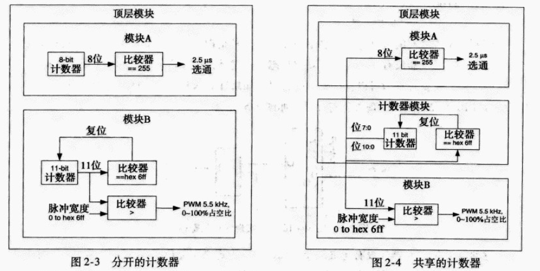

# Senior Fpga Design

## Fast Speed Structure

例如下面的例子是一个递归的算法,相同的变量和地址被存取直到计算完成,因为微处理器一次只执行一个指令,所以没有利用并行性

```verilog
module power3(
    output [7:0] XPower,
    output       finished,
    input  [7:0] X,
    input  clk,start); //the duration of start is a single clock

    reg [7:0] ncount;
    reg [7:0] XPower;

    assign finished = (ncount == 0);

    always @ (posedge clk)
        if(start) begin
            XPower <= X;
            ncount <= 2;
        end
        else if(!finished) begin
            ncount <= ncount - 1;
            XPower <= XPower * X;
        end
endmodule
```

与相同算法的流水线版本对比

```verilog
module power3(
    output reg [7:0] XPower,
    input      clk,
    input      [7:0] X
);

reg [7:0] XPower1,XPower2;
reg [7:0] X1,X2;
always @(posedge clk) begin
    //pipeline stage 1
    X1 <= X;
    XPower1 <= X;

    //pipeline stage 2
    X2 <= X1;
    XPower2 <= XPower1 *  X1;

    //pipeline stage 3
    XPower <= XPower2 * X2;
end
endmodule

```
流量的性能超过了迭代实现的三倍

2. 并行结构

为了产生并行结构,可以将乘法器分解为独立的操作,然后重新组合他们

```verilog
module power3(
    output [7:0] XPower,
    input  [7:0] X,
    input clk
);

reg [7:0] XPower1,
//partial product registers
reg [3:0] XPower2_ppAA,XPower2_ppAB,XPower2_ppBB;
reg [3:0] XPower3_ppAA,XPower3_ppAB,XPower3_ppBB;
reg [7:0] X1,X2;
wire [7:0] XPower2;

wire [3:0] XPower1_A     = XPower1[7:4];
wire [3:0] XPower1_B     = XPower1[3:0];
wire [3:0] X1_A          = X1[7:4];
wire [3:0] X1_B          = X1[3:0];
wire [3:0] XPower2_A     = XPower2[7:4];
wire [3:0] XPower2_B     = XPower2[3:0];
wire [3:0] X2_A          = X2[7:4];
wire [3:0] X2_B          = X2[3:0];

assign XPower2 = (XPower2_ppAA << 8) + (2 * XPower2_ppAB <<4) + XPower2_ppBB;
assign XPower  = (XPower3_ppAA << 8) + (2 * XPower3_ppAB <<4) + XPower3_ppBB;

always @(posedge clk) begin
    //pipeline stage 1
    X1 <= X;
    XPower1 <= X;
    //pipeline 2
    X2 <= X1;
    //create partial products
    XPower2_ppAA <= XPower1_A * X1_A;
    XPower2_ppAB <= XPower1_A * X1_B;
    XPower2_ppBB <= XPower1_B * X1_B;

    //pipeline stage 3
    //create partial products
    XPower3_ppAA <= XPower2_A * X2_A;
    XPower3_ppAB <= XPower2_A * X2_B;
    XPower3_ppBB <= XPower2_B * X2_B;
end
endmodule

```

3. 扩展逻辑结构

控制信号特权和非特权

```verilog
module regwrite(
    output reg [3:0] rout;
    input clk,in;
    input [3:0] ctrl
);

always @(posedge clk) begin
    //特权
    if(ctrl[0]) rout[0] <=in;
    else if(ctrl[1]) rout[1] <=in;
    else if(ctrl[2]) rout[2] <=in;
    else if(ctrl[3]) rout[3] <=in;

    //非特权
    if(ctrl[0]) rout[0] <=in;
    if(ctrl[1]) rout[1] <=in;
    if(ctrl[2]) rout[2] <=in;
    if(ctrl[3]) rout[3] <=in;
end
```

4. 寄存器平衡

寄存器平衡,平等地重新分布寄存器之间的逻辑,减少任何两个寄存器之间最坏条件的延时,这个技术应该随时利用在关键路径和相邻路径之间逻辑高度不平衡时,因为时钟速度只由最坏路径来决定,可以做最小的改变而成功的平衡关键逻辑

```verilog
module adder(
    output reg [7:0] Sum,
    input [7:0] A,B,C,
    input clk
);

reg [7:0] rA,rB,rC;
always @(posedge clk) begin
    rA <= A;
    rB <= B;
    rC <= C;
    Sum <= rA + rB + rC;
end
endmodule
```

```verilog
module adder(
    output reg [7:0] Sum,
    input [7:0] A,B,C,
    input clk
);

reg [7:0] rABSum,rC;
always @(posedge clk) begin
   rABSum <= A+B;
   rC <=C;
   Sum <= rABSum + rC;
end
endmodule
```

5. 重新安排路径

在数据流中重新安排路径使关键路径最小化,当多个路径与关键路径组合时应该利用这个技术,组合路径可以重新安排以致关键路径可以移动到更接近目的寄存器

```verilog
module randomlogic(
    output reg [7:0] Out,
    input [7:0] A,B,C,
    input clk,
    input Cond1,Cond2
);

always @(posedge clk)
    if(Cond1) Out <= A;
    else if(Cond2 && (C < 8))
        Out <= B;
    else Out <=C;
endmodule

```
假设调试不互相排斥,可以修改代码重新安排比较器的长延时

```verilog
module randomlogic(
    output reg [7:0] Out,
    input [7:0] A,B,C,
    input clk,
    input Cond1,Cond2
);

always @(posedge clk)
    if(Cond2 && (C < 8))
        Out <= B;
    else if(Cond1) 
        Out <= A;
    else Out <=C;
endmodule
```

## 面积结构设计

### 折叠流水线
是上一章中拆开环路产生流水线的逆过程,要求更多的资源保存中间数值,以及并行地运行需要复制计算结构,上一章的方法都增加了面积

考虑下面的例子:
```verilog
module mult8(
    output [7:0] product,
    input [7:0] A,
    input [7:0] B,
    input clk);

    reg [15:0] prod16;
    assign product = prod16[15:8];
    always @(posedge clk)
        prod16 <= A * B;
endmodule
```
这里虽然没有明显的流水线,但是乘法器本身是十分长的逻辑链,即添加中间的寄存器层很容易流水线起来

可以使用一系列的移位和加操作如下执行乘法将它折叠：

```verilog
module mult8(
    output   done,
    output reg [7:0] product,
    input  [7:0] A,
    input  [7:0] B,
    input  clk,
    input start
);

reg [4:0] multcounter; //counter for number of shift 
reg [7:0] shiftB; //shift register for B
reg [7:0] shiftA; //shift register for A

wire adden; //enable addition
assign adden = shiftB[7] & !done;
assign done = multcounter[3];

always @(posede clk) begin
   //increment multiply counter for shift/add ops
   if(start) multcounter <= 0;
   else if(!done) multcounter <= multcounter + 1;
   // shift B
   if(start) multcounter <= 0;
   else if(!done) multcounter <= multcounter + 1;

   //shift register for A
   if(start) shiftA <= A;
   else shiftA[7:0] <= {shiftA[7],shiftA[7:1]};

   //calculate multiplication
   if(start) product <= 0;
   else if(adden) product <= product + shiftA;
end
endmodule
```

### 基于控制的逻辑复用

共享逻辑资源有时需要专门的控制电路来决定哪些元件是到特定结构的输入

每个寄存器总是专用于运行加法器的特定输入

为了确定这个变化,可以要求一个状态机作为附加的输入到逻辑

```verilog
module lowpassfir(
    output reg [7:0] filtout,
    output reg done,
    input clk,
    input [7:0] datain,
    input datavalid,
    input [7:0] coeffA,coeffB,coeffC
);

//define input/output samples
reg   [7:0] X0,X1,X2;
reg         multdonedelay;
reg         multstart;
reg   [7:0] multdat;
reg   [7:0] multcoeff;
reg   [2:0] state;
reg   [7:0] accum;
wire        multdone;
wire  [7:0] multout;

// shift-add multiplier for sample-coeff mults
mult8x8 mult8x8(.clk(clk),.dat1(multdat),.dat2(multcoeff),.start(multstart),.done(multdone),.multout(multout));

always @(posedge clk) begin
    multdonedelay <= multdone;

    // accumsum <= accum + multout[7:0];
    if(clearaccum)  accum <= 0;
    else if(multdonedelay) accum <= accumsum;

    // do not process state machine if multiply is not done
    case(state)
        0: begin
           // idle state
           if(datavalid) begin
              // if a new sample has arrived
              // shift samples
              X0 <= datain;
              X1 <= X0;
              X2 <= X1;
              multdat <= datain;
              multcoeff <= coeffA;
              multstart <= 1;
              clearaccum <= 1; //clear accum
              state <= 1;
            end
            else begin
                multstart <= 0;
                clearaccum <= 0;
                done <= 0;
            end
        end

        1: begin
            if(multdonedelay) begin
                // A * X[0] is done,load B* X[1]
                multdat <= X1;
                multcoeff <= coeffB;
                multstart <= 1;
                state <= 2;
            end
            else begin
                multstart <= 0;
                clearaccum <= 0;
                done <= 0;
            end
        end

        2: begin
           if(multdonedelay) begin
             multdat <= X2;
             multcoeff <= coeffC;
             multstart <= 1;
             state <= 3;
            end
            else begin
                multstart <= 0;
                clearaccum <= 0;
                done <= 0;
            end
        end

        3: begin
           if(multdonedelay) begin
            filtout <= accumsum;
            done <= 1;
            state <= 0;
           end
           else begin
                multstart <= 0;
                clearaccum <= 0;
                done <= 0;
            end
        end
        default :
            state <= 0;
        end
    endmodule
```

### 资源共享

资源共享是指不同资源在横跨不同的功能范围内共享

只要有功能块可以在设计的其他部分甚至在不同的模块利用,就可以利用这类资源共享

通常这些计数器可以集中到更高的层次,并分配到多个功能单元



### 复位对面积的影响

不正确的复位策略可以产生不必要的大的设计和抑制一些面积优化

1. 无复位的资源

```verilog
always @(posedge iClk)
    if(!iReset) sr <= 0;
    else sr <= {sr[14:0],iDat};
```
```verilog
always @(posedge iClk)
    sr <= {sr[14:0],iDat};
```

2. 无置位的资源

```verilog
module mult8(
    output reg [15:0] oDat,
    input  iReset,iClk,
    input  [7:0] iDat1,iDat2,
);

always @(posedge iClk)
    if(!iReset) oDat <= 16'hffff;
    else oDat <= iDat1 * iDat2;
endmodule
```

改变乘法器置位为复位操作,可以减少9个逻辑片和16个片内触发器到单个逻辑片和单个片内触发器

3. 无同步复位的资源

```verilog
module dspckt(
    output reg [15:0] oDat,
    input iReset,iClk,
    input [7:0] iDat1,iDat2
);

reg [15:0] multfactor;

always @(posedge iClk or negedge iReset)
    if(!iReset) begin
        multfactor <= 0;
        oDat <= 0;
    end
    else begin
        multfactor <= iDat1 * iDat2;
        oDat <= multfactor + oDat;
    end
endmodule
```


4. 复位RAM

在许多FPGA内置的RAM资源中有复位的资源,类似于上一节中描述的DSP资源,常常只有同步复位是有效的

复位RAM通常是欠佳的设计实践,特别是当复位还是异步的

```verilog
module resetckt(
    output reg [15:0] oDat,
    input iReset,iClk,iWrEn,
    input [7:0] iAddr,oAddr,
    input [15:0] iDat
);

reg [15:0] memdat [0:255];

always @(posedge iClk or negedge iReset)
    if(!iReset) begin
        oDat <= 0;
    else begin
        if(iWrEn) memdat[iAddr] <= iDat;
        oDat <= memdat[oAddr];
    end
endmodule
```

5. 利用置位/复位触发器引脚

为异步复位能力利用了可复位的触发器,逻辑函数按离散逻辑实现

```verilog
module setreset(
    output reg oDat,
    input iReset,iClk,
    input iDat1,iDat2
);

always @(posedge iClk or negedge iReset)
    if(!iReset) oDat <= 0;
    else oDat <= iDat1 | iDat2;
endmodule
```

