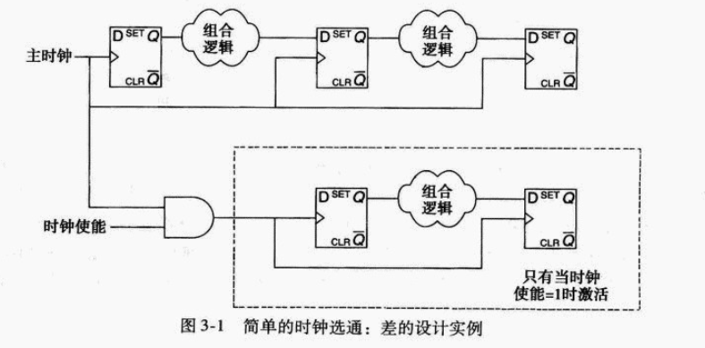
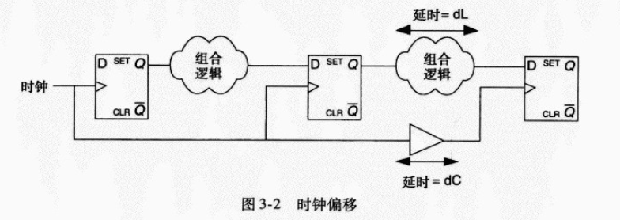
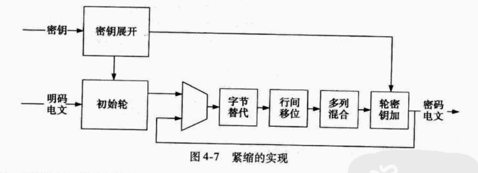

# Senior Fpga Design

## Fast Speed Structure

例如下面的例子是一个递归的算法,相同的变量和地址被存取直到计算完成,因为微处理器一次只执行一个指令,所以没有利用并行性

```verilog
module power3(
    output [7:0] XPower,
    output       finished,
    input  [7:0] X,
    input  clk,start); //the duration of start is a single clock

    reg [7:0] ncount;
    reg [7:0] XPower;

    assign finished = (ncount == 0);

    always @ (posedge clk)
        if(start) begin
            XPower <= X;
            ncount <= 2;
        end
        else if(!finished) begin
            ncount <= ncount - 1;
            XPower <= XPower * X;
        end
endmodule
```

与相同算法的流水线版本对比

```verilog
module power3(
    output reg [7:0] XPower,
    input      clk,
    input      [7:0] X
);

reg [7:0] XPower1,XPower2;
reg [7:0] X1,X2;
always @(posedge clk) begin
    //pipeline stage 1
    X1 <= X;
    XPower1 <= X;

    //pipeline stage 2
    X2 <= X1;
    XPower2 <= XPower1 *  X1;

    //pipeline stage 3
    XPower <= XPower2 * X2;
end
endmodule

```
流量的性能超过了迭代实现的三倍

2. 并行结构

为了产生并行结构,可以将乘法器分解为独立的操作,然后重新组合他们

```verilog
module power3(
    output [7:0] XPower,
    input  [7:0] X,
    input clk
);

reg [7:0] XPower1,
//partial product registers
reg [3:0] XPower2_ppAA,XPower2_ppAB,XPower2_ppBB;
reg [3:0] XPower3_ppAA,XPower3_ppAB,XPower3_ppBB;
reg [7:0] X1,X2;
wire [7:0] XPower2;

wire [3:0] XPower1_A     = XPower1[7:4];
wire [3:0] XPower1_B     = XPower1[3:0];
wire [3:0] X1_A          = X1[7:4];
wire [3:0] X1_B          = X1[3:0];
wire [3:0] XPower2_A     = XPower2[7:4];
wire [3:0] XPower2_B     = XPower2[3:0];
wire [3:0] X2_A          = X2[7:4];
wire [3:0] X2_B          = X2[3:0];

assign XPower2 = (XPower2_ppAA << 8) + (2 * XPower2_ppAB <<4) + XPower2_ppBB;
assign XPower  = (XPower3_ppAA << 8) + (2 * XPower3_ppAB <<4) + XPower3_ppBB;

always @(posedge clk) begin
    //pipeline stage 1
    X1 <= X;
    XPower1 <= X;
    //pipeline 2
    X2 <= X1;
    //create partial products
    XPower2_ppAA <= XPower1_A * X1_A;
    XPower2_ppAB <= XPower1_A * X1_B;
    XPower2_ppBB <= XPower1_B * X1_B;

    //pipeline stage 3
    //create partial products
    XPower3_ppAA <= XPower2_A * X2_A;
    XPower3_ppAB <= XPower2_A * X2_B;
    XPower3_ppBB <= XPower2_B * X2_B;
end
endmodule

```

3. 扩展逻辑结构

控制信号特权和非特权

```verilog
module regwrite(
    output reg [3:0] rout;
    input clk,in;
    input [3:0] ctrl
);

always @(posedge clk) begin
    //特权
    if(ctrl[0]) rout[0] <=in;
    else if(ctrl[1]) rout[1] <=in;
    else if(ctrl[2]) rout[2] <=in;
    else if(ctrl[3]) rout[3] <=in;

    //非特权
    if(ctrl[0]) rout[0] <=in;
    if(ctrl[1]) rout[1] <=in;
    if(ctrl[2]) rout[2] <=in;
    if(ctrl[3]) rout[3] <=in;
end
```

4. 寄存器平衡

寄存器平衡,平等地重新分布寄存器之间的逻辑,减少任何两个寄存器之间最坏条件的延时,这个技术应该随时利用在关键路径和相邻路径之间逻辑高度不平衡时,因为时钟速度只由最坏路径来决定,可以做最小的改变而成功的平衡关键逻辑

```verilog
module adder(
    output reg [7:0] Sum,
    input [7:0] A,B,C,
    input clk
);

reg [7:0] rA,rB,rC;
always @(posedge clk) begin
    rA <= A;
    rB <= B;
    rC <= C;
    Sum <= rA + rB + rC;
end
endmodule
```

```verilog
module adder(
    output reg [7:0] Sum,
    input [7:0] A,B,C,
    input clk
);

reg [7:0] rABSum,rC;
always @(posedge clk) begin
   rABSum <= A+B;
   rC <=C;
   Sum <= rABSum + rC;
end
endmodule
```

5. 重新安排路径

在数据流中重新安排路径使关键路径最小化,当多个路径与关键路径组合时应该利用这个技术,组合路径可以重新安排以致关键路径可以移动到更接近目的寄存器

```verilog
module randomlogic(
    output reg [7:0] Out,
    input [7:0] A,B,C,
    input clk,
    input Cond1,Cond2
);

always @(posedge clk)
    if(Cond1) Out <= A;
    else if(Cond2 && (C < 8))
        Out <= B;
    else Out <=C;
endmodule

```
假设调试不互相排斥,可以修改代码重新安排比较器的长延时

```verilog
module randomlogic(
    output reg [7:0] Out,
    input [7:0] A,B,C,
    input clk,
    input Cond1,Cond2
);

always @(posedge clk)
    if(Cond2 && (C < 8))
        Out <= B;
    else if(Cond1) 
        Out <= A;
    else Out <=C;
endmodule
```

## 面积结构设计

### 折叠流水线
是上一章中拆开环路产生流水线的逆过程,要求更多的资源保存中间数值,以及并行地运行需要复制计算结构,上一章的方法都增加了面积

考虑下面的例子:
```verilog
module mult8(
    output [7:0] product,
    input [7:0] A,
    input [7:0] B,
    input clk);

    reg [15:0] prod16;
    assign product = prod16[15:8];
    always @(posedge clk)
        prod16 <= A * B;
endmodule
```
这里虽然没有明显的流水线,但是乘法器本身是十分长的逻辑链,即添加中间的寄存器层很容易流水线起来

可以使用一系列的移位和加操作如下执行乘法将它折叠：

```verilog
module mult8(
    output   done,
    output reg [7:0] product,
    input  [7:0] A,
    input  [7:0] B,
    input  clk,
    input start
);

reg [4:0] multcounter; //counter for number of shift 
reg [7:0] shiftB; //shift register for B
reg [7:0] shiftA; //shift register for A

wire adden; //enable addition
assign adden = shiftB[7] & !done;
assign done = multcounter[3];

always @(posede clk) begin
   //increment multiply counter for shift/add ops
   if(start) multcounter <= 0;
   else if(!done) multcounter <= multcounter + 1;
   // shift B
   if(start) multcounter <= 0;
   else if(!done) multcounter <= multcounter + 1;

   //shift register for A
   if(start) shiftA <= A;
   else shiftA[7:0] <= {shiftA[7],shiftA[7:1]};

   //calculate multiplication
   if(start) product <= 0;
   else if(adden) product <= product + shiftA;
end
endmodule
```

### 基于控制的逻辑复用

共享逻辑资源有时需要专门的控制电路来决定哪些元件是到特定结构的输入

每个寄存器总是专用于运行加法器的特定输入

为了确定这个变化,可以要求一个状态机作为附加的输入到逻辑

```verilog
module lowpassfir(
    output reg [7:0] filtout,
    output reg done,
    input clk,
    input [7:0] datain,
    input datavalid,
    input [7:0] coeffA,coeffB,coeffC
);

//define input/output samples
reg   [7:0] X0,X1,X2;
reg         multdonedelay;
reg         multstart;
reg   [7:0] multdat;
reg   [7:0] multcoeff;
reg   [2:0] state;
reg   [7:0] accum;
wire        multdone;
wire  [7:0] multout;

// shift-add multiplier for sample-coeff mults
mult8x8 mult8x8(.clk(clk),.dat1(multdat),.dat2(multcoeff),.start(multstart),.done(multdone),.multout(multout));

always @(posedge clk) begin
    multdonedelay <= multdone;

    // accumsum <= accum + multout[7:0];
    if(clearaccum)  accum <= 0;
    else if(multdonedelay) accum <= accumsum;

    // do not process state machine if multiply is not done
    case(state)
        0: begin
           // idle state
           if(datavalid) begin
              // if a new sample has arrived
              // shift samples
              X0 <= datain;
              X1 <= X0;
              X2 <= X1;
              multdat <= datain;
              multcoeff <= coeffA;
              multstart <= 1;
              clearaccum <= 1; //clear accum
              state <= 1;
            end
            else begin
                multstart <= 0;
                clearaccum <= 0;
                done <= 0;
            end
        end

        1: begin
            if(multdonedelay) begin
                // A * X[0] is done,load B* X[1]
                multdat <= X1;
                multcoeff <= coeffB;
                multstart <= 1;
                state <= 2;
            end
            else begin
                multstart <= 0;
                clearaccum <= 0;
                done <= 0;
            end
        end

        2: begin
           if(multdonedelay) begin
             multdat <= X2;
             multcoeff <= coeffC;
             multstart <= 1;
             state <= 3;
            end
            else begin
                multstart <= 0;
                clearaccum <= 0;
                done <= 0;
            end
        end

        3: begin
           if(multdonedelay) begin
            filtout <= accumsum;
            done <= 1;
            state <= 0;
           end
           else begin
                multstart <= 0;
                clearaccum <= 0;
                done <= 0;
            end
        end
        default :
            state <= 0;
        end
    endmodule
```

### 资源共享

资源共享是指不同资源在横跨不同的功能范围内共享

只要有功能块可以在设计的其他部分甚至在不同的模块利用,就可以利用这类资源共享

通常这些计数器可以集中到更高的层次,并分配到多个功能单元


### 复位对面积的影响

不正确的复位策略可以产生不必要的大的设计和抑制一些面积优化

1. 无复位的资源

```verilog
always @(posedge iClk)
    if(!iReset) sr <= 0;
    else sr <= {sr[14:0],iDat};
```
```verilog
always @(posedge iClk)
    sr <= {sr[14:0],iDat};
```

2. 无置位的资源

```verilog
module mult8(
    output reg [15:0] oDat,
    input  iReset,iClk,
    input  [7:0] iDat1,iDat2,
);

always @(posedge iClk)
    if(!iReset) oDat <= 16'hffff;
    else oDat <= iDat1 * iDat2;
endmodule
```

改变乘法器置位为复位操作,可以减少9个逻辑片和16个片内触发器到单个逻辑片和单个片内触发器

3. 无同步复位的资源

```verilog
module dspckt(
    output reg [15:0] oDat,
    input iReset,iClk,
    input [7:0] iDat1,iDat2
);

reg [15:0] multfactor;

always @(posedge iClk or negedge iReset)
    if(!iReset) begin
        multfactor <= 0;
        oDat <= 0;
    end
    else begin
        multfactor <= iDat1 * iDat2;
        oDat <= multfactor + oDat;
    end
endmodule
```


4. 复位RAM

在许多FPGA内置的RAM资源中有复位的资源,类似于上一节中描述的DSP资源,常常只有同步复位是有效的

复位RAM通常是欠佳的设计实践,特别是当复位还是异步的

```verilog
module resetckt(
    output reg [15:0] oDat,
    input iReset,iClk,iWrEn,
    input [7:0] iAddr,oAddr,
    input [15:0] iDat
);

reg [15:0] memdat [0:255];

always @(posedge iClk or negedge iReset)
    if(!iReset) begin
        oDat <= 0;
    else begin
        if(iWrEn) memdat[iAddr] <= iDat;
        oDat <= memdat[oAddr];
    end
endmodule
```

5. 利用置位/复位触发器引脚

为异步复位能力利用了可复位的触发器,逻辑函数按离散逻辑实现

```verilog
module setreset(
    output reg oDat,
    input iReset,iClk,
    input iDat1,iDat2
);

always @(posedge iClk or negedge iReset)
    if(!iReset) oDat <= 0;
    else oDat <= iDat1 | iDat2;
endmodule
```

**小结**

*   折叠流水线可以优化在流水线级复制逻辑的流水线设计的面积。
*   当共享逻辑比控制逻辑更大时，控制可以直接用来逻辑复用。
*   对于面积是主要要求的紧凑设计，搜索在其他模块中有类似计数部件的资源，可以把他们放到层次上的全局位置，在多个功能范围之间共享。
*   不正确的复位策略可以产生不必要的大的设计和抑制一些面积优化。
*   优化的 FPGA 资源在不相容的复位分配到它时将不被利用，但利用一般的元件实现其功能，将占用更多的面积。
*   DSPs 和其他多功能资源一般对复位策略的变化是不灵活的。
*   不正确地复位一个 RAM 可能对面积有惊人的影响。
*   利用置位/复位可能阻止一些组合逻辑的优化。
*   当面积是考虑的关键时，尽可能避免利用置位和复位。


## 功耗结构设计

### 时钟控制

在同步数字电路中降低动态功耗的最有效和广泛使用的技术是动态禁止在特定区域中的时钟,在数据流中这个区域不需要在特定级激活

利用这个时钟拓扑,只要主时钟是激活的,所有的触发器和响应的组合逻辑就是激活的，在虚线框内的逻辑仅仅在时钟使能clock enable= 1才激活



1. 时钟偏移



在第二个和第三个触发器级之间的情况是复杂的

因为第二个和第三个触发器级之间时钟线上的延时,有效的时钟沿将不在同时出现,相反,第三个触发器上的有效时钟沿将延时一个数值dc

2. 控制偏移

FPGA提供的低偏移资源确保时钟信号将对所有时钟输入尽可能的匹配

可以想到,通过选通门的延时加上布线延时将比通过逻辑的延时DL大,为了解决这个潜在问题,实现和分析工具必须给出一组约束,使得与通过选通项偏移有关的任何时序问题可以去除,然后在实现后的分析中适当地加以分析

```verilog
module clockgating(
    output dataout,
    input clk,datain,
    input clockgate1
);
reg ff0,ff1,ff2;
wire clk1;

// clocks are disabled when gate is low
assign clk1 = clk & clockgate1;
assign dataout = ff2;
always @(posedge clk)
    ff0 <= datain;
always @(posedge clk)
    ff1 <= ff0;
always @(posedge clk1)
    ff2 <= ff1;
endmodule
```

<mark> 时钟选通可以引起保持的冲突,可能或者不可能被实现工具校正 </mark>


### 输入控制

<mark> 为了使输入器件的功耗最小化,最小化驱动输入的信号上升和下降时间</mark>

<mark> 总是端接不利用的输入缓冲器,从不让一个FPGA输入缓冲器悬空着</mark>

### 减少供电电压

降低FPGA电源的供电电压接近最小要求的电压,可以达到显著地节省功率

降低这个电压也将减少系统的性能

<mark>动态功耗随着核电压的平方减弱,但是降低电压对性能有负面的影响</mark>

### 双沿触发触发器

双沿触发的触发器提供在时钟的两个沿而不是一个沿上传播数据的机构,这允许设计者运行的时钟频率只是要求达到确定程度功能和性能的频率的一半

```verilog
module dualedge(
    output reg dataout,
    input clk,datain
);

reg ff0,ff1;
always @(posedge clk)
    ff0 <= datain;

always @(posedge clk or negedge clk) begin
    ff1 <= ff0;
    dataout <= ff1;
    end
endmodule
```

注意如果双沿触发器是无效的,将添加多余的触发器和选通来仿真相应的功能
这将完全失去利用双沿策略的目的,并在实现之后相应地分析

双沿触发的触发器应该只在他们被提供作为基本元件时才利用

### 修改终端

在带总线的系统,漏开路的输出或要求端接的传输线通常是连接到输出引脚的电阻负载

采用串行的端接没有稳态电流的消耗

缺点是:

* 从负载到端接电阻初始的反射
* 在转换期间通过串联电阻有少量的衰减


**总结**

*   诸如何时钟使能触发器输入或全局时钟多路选择器等时钟控制资源应该在其有效的场合代替直接时钟选通来利用。
*   时钟选通是减少动态功耗直接手段，但是在实现和时序分析中产生困难。
*   对 FPGA 设计者，选通时钟引入新的时钟区域，并将产生困难。
*   在 FPGA 中管理不好时钟偏移可以引起突发的故障。
*   时钟选通可以引起保持的冲突，可能或不可能被实现工具校正。
*   为了使输入器件的功耗最小化，应当使驱动输入的信号上升和下降时间最小化。
*   总是端接不利用的输入缓冲器，从不让一个 FPGA 输入缓冲器悬空着。
*   动态功耗随着核电压的平方减弱，但是降低电压对性能有负面的影响。
*   双沿触发的触发器应该只在他们被提供作为基本元件时才利用。
*   采用串行的端接没有稳态电流的消耗。


## 设计实例: 高级加密标准

### AES结构

AES是对称的密钥密码,映射128位明文到128位密文的块

并行地运行于数据通道的密钥表达式获取密码的密钥，为每个变换的轮产生一个唯一的密钥。令字 word = 32bit（位），Nk = 密钥尺寸/字尺寸（= 128, 192，或 256 / 32）。展开的密钥的第一个 Nk 字是用密码的密钥充满的，展开的密钥中每个子序列的 32 位字是前面的 32 位字和当前字前面的 32 位字的 Nk 字异或（XOR）。对于出现过 Nk 倍数的字，当前的字在异或操作之前经受一个变换，跟随着一个带轮常数的异或操作。这个变换是由一个轮排列组成，跟随着对 32 位字的全部四个字节的 8-byte 映射。轮常数由 FIPS 197 定义为由 [ x^(i-1), {00}, {00}, {00} ] 给出的数值，x^(i-1) 是 x 的幂，其中 x 作为在 GF (2^8) 有限域中 {02} 的标志。


**高级加密标准（AES）**中**密钥扩展（Key Expansion）**算法的核心原理和计算过程。AES 是目前全球最广泛使用的对称加密算法。

1. 基本概念与参数
*   **并行运行于数据通道**：指的是密钥扩展过程可以与主加密数据通道的计算并行进行，提高效率。
*   **字（Word）**：AES 算法中的基本计算单位，固定为 **32bit**（即4个字节）。
*   **Nk**：代表初始密钥包含的字数。计算公式为 `密钥尺寸 / 字尺寸`。
    *   128位密钥（AES-128）：Nk = 128 / 32 = **4**
    *   192位密钥（AES-192）：Nk = 192 / 32 = **6**
    *   256位密钥（AES-256）：Nk = 256 / 32 = **8**

2. 密钥扩展的生成规则
AES 加密是多轮运算（如 AES-128 需要 10 轮，每一轮都需要一个唯一的密钥）。密钥扩展的目的就是把一个较短的初始密钥，扩展成一系列用于每一轮加密的子密钥（轮密钥）。

*   **初始化**：展开后的密钥的前 Nk 个字，直接填入原始的初始密钥。
*   **后续字的生成规则**：
    *   **一般规则**：第 `i` 个字 = 第 `i-1` 个字 XOR 第 `i-Nk` 个字。
    *   **特殊规则（每 Nk 的倍数）**：当当前生成的字是第 Nk、2Nk、3Nk... 个字时，需要进行一次变换后再进行异或。

3. 特殊变换（针对第 Nk 倍数个字的处理）
当生成到第 Nk 倍数的字时，不能直接异或，需要先对前一个字进行如下三步变换：
1.  **轮排列（RotWord）**：将字的4个字节循环左移一位。
2.  **8-byte 映射（SubWord / S-Box）**：通过 S 盒（非线性查找表）对这4个字节进行逐一替换（文中所说的“8-byte映射”可能是翻译或表述上的习惯，实际上是对每个字节进行替换，因为 1 byte = 8 bit）。
3.  **异或轮常数（Rcon）**：将上述结果与一个称为“轮常数”的值进行异或。
    *   **轮常数的定义**：`[ x^(i-1), {00}, {00}, {00} ]`。这是一个字，只有第一个字节有值，后三个字节是 00。
    *   **x 的幂（x^(i-1)）**：这里的 x 是有限域 **GF(2^8)** 中的一个特殊元素（标志为 {02}），它的幂次运算遵循特定的多项式模运算规则。

```verilog
module KeyExp1Enc(
    //updated values to be passed to next iteration
    output [3:0] oKeyIter,oKeyIterModNk,oKeyIterDivNk,
    output [32 * 'Nk-1:0] oNkKeys,
    input  iClk,iReset,
    // represents total # of iterations and values mod Nk
    input [3:0] iKeyIter,iKeyIterModNk,iKeyIterDivNk,
    // the last Nk Keys generated in key expansion
// The last Nk keys generated in key expansion
input [32*'Nk-1:0]  iNkKeys);

// updated values to be passed to next iteration
reg [3:0]           oKeyIter, oKeyIterModNK,
                    oKeyIterDivNK;
reg [32*'Nk-1:0]    OldKeys;
wire [31:0]         InterKey; // intermediate key value
wire [32*'Nk-1:0]   oNkKeys;
wire [31:0]         PrevKey, RotWord, SubWord,
                    NewKeyWord;
wire [31:0]         KeyWordNk;
wire [31:0]         Rcon;

assign PrevKey      =       iNkKeys[31:0]; // last word in key array
                                                       

assign KeyWordNk    =       OldKeys[32*'Nk-1:32*'Nk-32];

// 1 byte cyclic permutation
assign RotWord      =       {PrevKey[23:0], PrevKey[31:24]};
// new key calculated in this round
assign NewKeyWord = KeyWordNk ^ InterKey;

// calculate new key set
assign oNkKeys = {OldKeys[32*'Nk-33:0], NewKeyWord};

// calculate Rcon over GF(2^8)
assign Rcon         = iKeyIterDivNk == 8'h1 ? 32'h01000000 :
                      iKeyIterDivNk == 8'h2 ? 32'h02000000 :
                      iKeyIterDivNk == 8'h3 ? 32'h04000000 :
                      iKeyIterDivNk == 8'h4 ? 32'h08000000 :
                      iKeyIterDivNk == 8'h5 ? 32'h10000000 :
                      iKeyIterDivNk == 8'h6 ? 32'h20000000 :
                      iKeyIterDivNk == 8'h7 ? 32'h40000000 :
                      iKeyIterDivNk == 8'h8 ? 32'h80000000 :
                      iKeyIterDivNk == 8'h9 ? 32'h1b000000 :
                      32'h36000000;


SboxEnc SboxEnc0(.iPreMap(RotWord[31:24]),
                          .oPostMap(SubWord[31:24]));
SboxEnc SboxEnc1(.iPreMap(RotWord[23:16]),
                          .oPostMap(SubWord[23:16]));
SboxEnc SboxEnc2(.iPreMap(RotWord[15:8]),
                          .oPostMap(SubWord[15:8]));
SboxEnc SboxEnc3(.iPreMap(RotWord[7:0]),
                          .oPostMap(SubWord[7:0]));

`ifdef Nk8

wire [31:0] SubWordNk8;

// Substitution only when Nk = 8
SboxEnc SboxEncNk8_0(.iPreMap(PrevKey[31:24]),
                              .oPostMap(SubWordNk8[31:24]));
SboxEnc SboxEncNk8_1(.iPreMap(PrevKey[23:16]),
                              .oPostMap(SubWordNk8[23:16]));
SboxEnc SboxEncNk8_2(.iPreMap(PrevKey[15:8]),
                              .oPostMap(SubWordNk8[15:8]));
SboxEnc SboxEncNk8_3(.iPreMap(PrevKey[7:0]),
                              .oPostMap(SubWordNk8[7:0]));

`endif

always @(posedge iClk)
if(!iReset) begin
    oKeyIter           <= 0;
    oKeyIterModNk      <= 0;
    InterKey           <= 0;
    oKeyIterDivNk      <= 0;
    OldKeys            <= 0;
end else begin
    oKeyIter           <= iKeyIter + 1;
    OldKeys            <= iNkKeys;

// update "Key iteration mod Nk" for next iteration
    if(iKeyIterModNk + 1 == 'Nk) begin
        oKeyIterModNk  <= 0;
        oKeyIterDivNk  <= iKeyIterDivNk+1;
    end
    else begin
        oKeyIterModNk  <= iKeyIterModNk + 1;
        oKeyIterDivNk  <= iKeyIterDivNk;
    end

    if(iKeyIterModNk == 0)
        InterKey       <= SubWord ^ Rcon;
`ifdef Nk8
// an option only for Nk = 8
    else if(iKeyIterModNk == 4)
        InterKey       <= SubWordNk8;
`endif
    else
        InterKey       <= PrevKey;
end
endmodule
```
代码解析：

1. 模块接口：
* 参数 'Nk：代表初始密钥包含的 32 位字（Word）的数量。例如 AES-128 为 4，AES-256 为 8。
* iKeyIter, iKeyIterModNk, iKeyIterDivNk：当前的迭代计数器、迭代对 Nk 取模的值、以及迭代除以 Nk 的值。这些用于控制密钥扩展的进度。
* iNkKeys:上一轮生成的 Nk 个密钥,作为当前计算的依赖输入。

* oKeyIter, oKeyIterModNk, oKeyIterDivNk：更新后的迭代计数器，传递给下一个时钟周期。
* oNkKeys: 当前周期计算得到的新的一组密钥

2. 组合逻辑替换

PrevKey：上一轮生成的密钥，用于计算当前轮的密钥。
RotWord：将 PrevKey 的四个字节循环左移一位。
SubWord：通过 S 盒对 RotWord 的四个字节进行替换。
Rcon：轮常数，用于在特定轮次进行异或操作。对应AES标准中的GF(2^8)有限域中的幂次运算规则。

NewKeyWord：当前轮的密钥，通过上一轮的密钥和当前轮的中间值进行异或操作。

```verilog
module RoundEnc(
    output [32*'Nb-1:0]    oBlockOut,
    output                 oValid,
    input                  iClk, iReset,
    input [32*'Nb-1:0]     iBlockIn, iRoundKey,
    input                  iReady,
    input [3:0]            iRound);

    wire [32*'Nb-1:0] wSubOut, wShiftOut, wMixOut;
    wire              wValidSub, wValidShift, wValidMix;

    SubBytesEnc sub(
        .iClk(iClk), .iReset(iReset),
        .iBlockIn(iBlockIn),
        .oBlockOut(wSubOut),
        .iReady(iReady),
        .oValid(wValidSub));

    ShiftRowsEnc shift(
        .iClk(iClk), .iReset(iReset),
        .iBlockIn(wSubOut), .oBlockOut(wShiftOut),
        .iReady(wValidSub), .oValid(wValidShift));

    MixColumnsEnc mixcolumn(
        .iClk(iClk), .iReset(iReset),
        .iBlockIn(wShiftOut),
        .oBlockOut(wMixOut),
        .iReady(wValidShift),
        .oValid(wValidMix),
        .iRound(iRound));

    AddRoundKeyEnc addroundkey(
        .iClk(iClk), .iReset(iReset),
        .iBlockIn(wMixOut),
        .oBlockOut(oBlockOut),
        .iRoundKey(iRoundKey),
        .iReady(wValidMix),
        .oValid(oValid));

endmodule
```

字节代换可以使用一个8bit x 256 (2 ^ 8) 的查找表rom来实现

紧缩结构

进入的数据和密钥在初始轮模块中相加在一起,在进入加密环路之前,将结果寄存,按照规定的顺序,将数据加到字节代换,行间移位,多列变换和轮密钥加
在每伦茨的结尾,新的数据被寄存，按照轮的次数重复这些操作




以下的代码表示顶层实现:

```verilog
module AES_core(
    output [32*'Nb-1:0]    oCiphertext, // output ciphertext
    output                 oValid,      // data at output is valid
    // signals that new key has been completely processed
    output                 oKeysValid,
    input                  iClk, iReset,
    input [32*'Nb-1:0]     iPlaintext,  // input data to be encrypted
    input [32*'Nk-1:0]     iKey,        // input cipher key
    input                  iReady,      // valid data to encrypt
    input                  iNewKey);    // signals new key is input

    wire [32*'Nb-1:0]      wRoundKey1, wRoundKey2,
                           wRoundKey3, wRoundKey4,
                           wRoundKey5, wRoundKey6,
                           wRoundKey7, wRoundKey8,
                           wRoundKey9, wRoundKeyFinal,
                           wRoundKeyInit;

    wire [32*'Nb-1:0]      wBlockOut1, wBlockOut2,
                           wBlockOut3, wBlockOut4,
                           wBlockOut5, wBlockOut6,
                           wBlockOut7, wBlockOut8,
                           wBlockOut9, wBlockOutInit;

    wire [32*'Nk-1:0]      wNkKeysInit;
    wire [3:0]             wKeyIterInit;
    wire [3:0]             wKeyIterModNkInit;
    wire [3:0]             wKeyIterDivNkInit;
    wire                   wValid1, wValid2, wValid3,

    module AES_core(
    output [32*'Nb-1:0]    oCiphertext, // output ciphertext
    output                 oValid,      // data at output is valid
    // signals that new key has been completely processed.
    output                 oKeysValid,
    input                  iClk, iReset,
    input [32*'Nb-1:0]     iPlaintext,  // input data to be encrypted
    input [32*'Nk-1:0]     iKey,        // input cipher key
    input                  iReady,      // valid data to encrypt
    input                  iNewKey);    // signals new key is input

    wire [32*'Nb-1:0]      wRoundKey1, wRoundKey2,
                           wRoundKey3, wRoundKey4,
                           wRoundKey5, wRoundKey6,
                           wRoundKey7, wRoundKey8,
                           wRoundKey9, wRoundKeyFinal,
                           wRoundKeyInit;

    wire [32*'Nb-1:0]      wBlockOut1, wBlockOut2,
                           wBlockOut3, wBlockOut4,
                           wBlockOut5, wBlockOut6,
                           wBlockOut7, wBlockOut8,
                           wBlockOut9, wBlockOutFinal,
                           wBlockOutInit;

    wire [32*'Nk-1:0]      wNkKeysInit;
    wire [3:0]             wKeyIterInit;
    wire [3:0]             wKeyIterModNkInit;
    wire [3:0]             wKeyIterDivNkInit;
    wire                   wValid1, wValid2, wValid3,
                           wValid4,
                           wValid5, wValid6, wValid7,
                           wValid8,
                           wValid9, wValidFinal,
                           wValidInit;

    wire                   wNewKeyInit;
    wire [128*('Nr+1)-1:0] wKeys; // complete set of round keys

    // registered inputs
    wire [32*'Nk-1:0]      wKeyReg;
    wire                   wNewKeyReg, wReadyReg;
    wire [127:0]           wPlaintextReg;

    // register inputs
    InputRegs InputRegs(
        .iClk(iClk), .iReset(iReset),
        .iKey(iKey),
        .iNewKey(iNewKey),
        .iPlaintext(iPlaintext),
        .iReady(iReady), .oKey(wKeyReg),
        .oNewKey(wNewKeyReg),
        .oPlaintext(wPlaintextReg),
        .oReady(wReadyReg));

    // initial key expansion
    KeyExpInit KeyExpInit(
        .iClk(iClk), .iReset(iReset),
        .iNkKeys(wKeyReg), .iNewKey(wNewKeyReg),
        .oKeyIter(wKeyIterInit),
        .oNewKey(wNewKeyInit),
        .oKeyIterModNk(wKeyIterModNkInit),
        .oNkKeys(wNkKeysInit),
        .oKeyIterDivNk(wKeyIterDivNkInit));

    // initial addition of round key
    AddRoundKey InitialKey(
        .iClk(iClk), .iReset(iReset),
        .iBlockIn(wPlaintextReg),
        .iRoundKey(wRoundKeyInit),
        .oBlockOut(wBlockOutInit),
        .iReady(wReadyReg),
        .oValid(wValidInit));

    // Number of rounds is a function of key size (10, 12, or 14)

    // Key expansion block
    KeyExpansion KeyExpansion(
        .iClk(iClk),
        .iReset(iReset),
        .iKeyIter(wKeyIterInit),
        .iKeyIterModNk(wKeyIterModNkInit),
        .iNkKeys(wNkKeysInit),
        .iKeyIterDivNk(wKeyIterDivNkInit),
        .iNewKey(wNewKeyInit),
        .oKeys(wKeys), .oKeysValid(oKeysValid));

    // round transformation blocks
    Round R1(
        .iClk(iClk), .iReset
            (iReset),
            .iBlockIn(wBlockOutInit),
            .iRoundKey(wRoundKey1),
            .oBlockOut(wBlockOut1),
            .iReady(wValidInit),
            .oValid(wValid1));

    Round R9(
        .iClk(iClk), .iReset
            (iReset),
            .iBlockIn(wBlockOut8),
            .iRoundKey(wRoundKey9),
            .oBlockOut(wBlockOut9),
            .iReady(wValid8),
            .oValid(wValid9));

    // 10 rounds total
    // Initial key addition
    assign wRoundKeyFinal = wKeys[128*('Nr-7)-1:
                    128*('Nr-8)];
    // round key assignments
    assign wRoundKey9      = wKeys[128*('Nr-6)-1: 128*('Nr-7)];
    assign wRoundKey8      = wKeys[128*('Nr-5)-1: 128*('Nr-6)];
    assign wRoundKey7      = wKeys[128*('Nr-4)-1: 128*('Nr-5)];
    assign wRoundKey6      = wKeys[128*('Nr-3)-1: 128*('Nr-4)];
    assign wRoundKey5      = wKeys[128*('Nr-2)-1: 128*('Nr-3)];
    assign wRoundKey4      = wKeys[128*('Nr-1)-1: 128*('Nr-2)];
    assign wRoundKey3      = wKeys[128*'Nr-1: 128*('Nr-1)];
    assign wRoundKey2      = wKeys[128*('Nr+1)-1: 128*'Nr];

    assign wRoundKey1      = wNkKeysInit[128-1:0];
    assign wRoundKeyInit   = iKey[128-1:0];
    FinalRound FinalRound(
        .iClk(iClk), .iReset(iReset),
        .iBlockIn(wBlockOut9),
        .iRoundKey(wRoundKeyFinal),
        .oBlockOut(oCiphertext),
        .iReady(wValid9), .oValid(oValid));

endmodule
```


