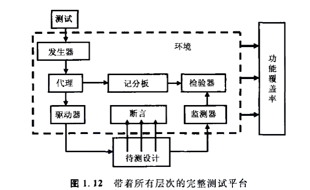
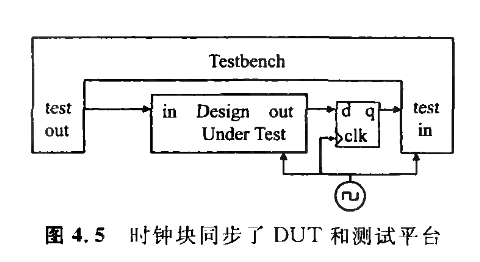
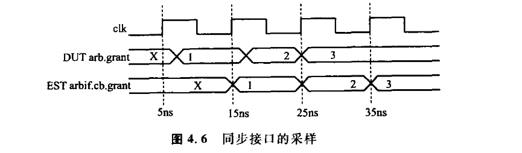
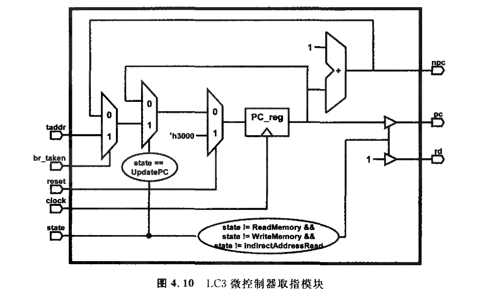
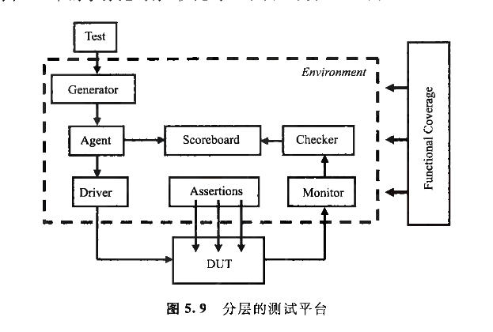

# SystemVerilog 验证平台

[TOC]

## 验证导论

SystemVerilog 硬件验证语言(Hard Verification Language，HVL)

具有以下性质；
1. 受约束的随机激励生成
2. 功能覆盖率
3. 更高层次的结构,尤其是面向对象的编程
4. 多线程及线程间通信
5. 支持HDL数据类型,例如verilog的四状态数值
6. 集成了事件仿真器,便于对设计施加控制

验证流程并行于设计流程:对于每个设计模块,设计者首先阅读硬件规范,解析其中的自然语言表述,然后使用RTL代码之类的机器语言创建相应的逻辑

测试平台用于确定待测设计的正确性；
1. 产生激励
2. 把激励施加到DUT上
3. 捕捉响应
4. 检验正确性
5. 对照整个验证目标测算进展情况

### 分层的测试平台

下面是一个不分层的测试平台的例子：

一个用于驱动APB引脚的任务
```verilog
task write(reg[15:0] addr,reg[31:0] data);
    //驱动控制总线
    @(posedge clk)
    PAddr <= addr;
    PWData <= data;
    PWrite<=1'b1;
    PSel<= 1'b1;

    //使PEnable翻转
    @(posedge clk)
    PEnable<=1'b0;
    @(posedge clk)
    PEnable<=1'b1;

endtask

module test(PAddr,PWrite,PSel,PWData,PEnable,Rst,clk);
initial begin
    //初始化
    reset();
    write(16'h50,32'h50);

    if(top.mem.memory[16'h50]!= 32'h50)
        $display("Test failed!");
    else
        $display("Test passed!");
end

endmodule
```

上面代码中:
在 Verilog 的 initial 块中使用 @(posedge clk)，其含义是让当前的执行流程暂停，并等待指定信号（如 clk）的下一个上升沿到来后，再继续执行后续的语句。

#### 信号和命令层

在底部的信号层,包含待测设计和把待测设计连接到测试平台的信号

再往上一层是命令层：执行总线读或写命令的驱动器驱动了待测设计的输入

待测设计的输出与监视器,连监视器负责检测信号的变化,并把这些变化按照命令分组

断言也穿过命令层和信号层,负责监视独立的信号以寻找穿越整个命令的信号变化

#### 功能层

功能层向下面对命令层

代理(VMM中的事务处理器)接收来自上层的事务,例如DMA读或写,把它们分解成独立的命令,这些命令也被送往用于预测事务结果的计分板

检验器负责比较来自监视器和计分板的命令

#### 场景层

场景层被位于场景层中的发生器驱动,比如mp3播放器,下载存储播放，调整播放内容这些操作的每一个都可以称作场景,场景层负责组织协调这些步骤,操作的参数如音轨大小和寄存器位置等都采用受约束的随机值




顶层的测试包含了用于创建激励的约束

功能覆盖率可以衡量所有测试在满足验证计划要求方面的进展,随着各项测试标准的完成,功能覆盖率代码在整个项目过程中会经常变化

在随机序列中间插入定向测试的代码,或者把两部分代码并列
定向代码执行你期望的任务,而随机的背景噪声可能使漏洞暴漏出来,而且漏洞还有可能是在未期望的模块中

### 建立一个分层的测试平台

驱动器可能会注入错误或者增加时延,然后再把命令分解为一些信号的变化,例如总线请求或握手
事务处理器,核心部分是一个循环:有关事务处理器的师范代码如下:

```verilog
task run();
    done = 0;
    while(!done) begin
    //获取下一个事务
    //进行变换
    //发送事务
    end
endtask
```

### 仿真环境阶段

使项目中的所有代码能够一起工作
三个基本阶段是建立,运行和收尾,每个阶段都可以再细分为更小的步骤；

建立阶段可以分为如下步骤:
1. 生成配置:把待测设计的配置和周围的环境随机化
2. 建立环境:基于配置来分配和连接测试平台构件,测试平台构件指的是存在于测试平台中的部分，与RTL代码描述的设计物理构件区分开:例如如果配置选择了三个总线驱动器,那么测试平台应该在这个阶段对它们进行分配和初始化
3. 对待测设计进行复位
4. 配置待测设计；基于第一步中生成的配置，载入待测设计的命令寄存器

运行阶段指测试实际运行的阶段,可分为以下步骤:
1. 启动环境：运行各种测试平台构件,例如各种BFM和激励发生器
2. 运行测试:启动测试然后等待测试完成,定向测试的完成很容易判断,但随机测试却比较困难,可以使用测试平台的层作为引导,从顶层启动,等待一个层接收完来自上一层的所有输入,接着等待当前层空闲下来,然后再等待下一层

收尾阶段:
1. 清空:在最下层完成以后,等待设计清空最后的事务
2. 报告:一旦待测设计空闲下来,清空遗留在测试平台中的数据,有时保存在积分板利的数据从来就没有送出来过，根据信息创建最终报告,说明测试通过或者失败,如果测试失败，将相应的结果功能覆盖率删除

## 数据类型

SystemVerilog 引进了一些新的数据类型,具有以下优点:
1. 双状态数据类型:更好的性能,更低的内存消耗
2. 队列,动态和关联数组:减小内存消耗,自带搜索和分类功能
3. 类和结构：支持抽象数据结构
4. 联合和合并结构：允许对同一数据有多种视图
5. 字符串:支持内建的字符序列
6. 枚举类型：方便代码编写,增加可读性

### 逻辑logic类型

Verilog中,初学者对经典的reg数据类型进行了改进,使得它除了作为一个变量以外,还可以被连续赋值,门单元和模块所驱动

为了与寄存器类型相区别,这种改进的数据类型被称为logic,任何使用线网的地方均可以使用logic,但要求logic不能有多个结构型的驱动
例如双向总线建模的时候,需要使用线网类型

logic 类型的使用

```systemverilog
module logic_data_type(input logic rst_h);
    parameter CYCLE = 20;
    logic q,q_l,d,clk,rst_l;
    initial begin
        clk = 0;   //过程赋值
        forever # (CYCLE/2) clk = ~clk;   //连续赋值
    end

    assign rst_l = ~rst_h; // 连续赋值
    not n1(q_l,q); // q_1被门驱动
    my_dff d1(q,d,clk,rst_l); //被模块驱动
endmodule
```

由于logic类型只能有一个驱动,所以其可被适用于查找网单中的漏登
如果存在多个驱动时,编译就会出现错误

### 双状态数据类型

相比四状态数据类型: 0 , 1 , X(未知) , Z(高阻态)

双状态数据类型有利于提高仿真性能并减少内存的使用量,最简单的双状态数据类型是bit,它是无符号的,另外四种带符号的双状态数据类型是byte,shortint,int 和longint

```systemverilog
bit b;                //双状态,单比特
bit [31:0] b32;       //双状态,32比特无符号整数
int unsigned ui;      //双状态,32比特无符号整数
int i;                //双状态,32比特有符号整数
byte b8;              //双状态,8比特有符号整数
shortint s;           //双状态,16比特有符号整数
longint l;            //双状态,64比特有符号整数
integer i4;           //四状态,32比特有符号整数
time t;               //四状态,64比特无符号整数
real r;               //双状态,双精度浮点数
```

对于双状态变量,被测设计试图产生X或Z，这些值会被转换成双状态值,而测试代码永远察觉不了

对四状态值的检查：

```systemverilog
if($isunknown(iport) == 1)
    $display("@%0t: 4-state value detected on iport %b", $time, iport);
```

### 定宽数组

定宽数组的声明和初始化
Verilog要求在声明中必须给出数组的上下界,因为几乎所有数组都使用0作为索引下界
所以SystemVerilog允许只给出数组宽度的便捷声明方式,跟C语言类似

定宽数组的声明
```systemverilog
int lo_hi[0:15];        //16个整数[0]...[15]
int c_style[16];         //等价声明方式
```

可以通过在变量后面指定维度的方式来创建多维定宽数组

下面创建了几个二维数组
```systemverilog
int arr[3][4];           //3行4列的整数数组
int arr2[0:2][0:3];     //等价声明方式
arr[1][2] = 1;  //设置元素值
```

很多SystemVerilog仿真器在存放数组元素时使用32比特的字边界,所以byte,shortint和int都是存放在一个字中,而longint则存放到两个字中

在非合并数组中,字的低位用来存放数据,高位则不使用
```systemverilog
bit [7:0] arr[3];       //3个字节的数组
```

### 常量数组

```systemverilog
int ascend[4] = '{1,2,3,4};  //等价声明方式
int descend[4];
descend = '{4,3,2,1};

<!-- 为前三个元素赋值 -->

descend[0:2] = '{3,2,1};  //等价声明方式
ascend ='{4{8}}; //四个值全部为0
descend = '{9,8,default:1};
```

基本的数组操作:for和foreach

在数组操作中使用for和foreach循环
```systemverilog
initial begin
    bit [31:0] src[5],dst[5];
    for(int i = 0;i<$size(src);i++)
        src[i] = i;
    foreach(dst[j])
        dst[j] = src[j]*2; //dst的值是src的两倍
    end
```

初始化并遍历多维数组
```systemverilog
int md[2][3] = '{'{1,2,3},'{4,5,6}}; //二维数组的初始化
initial begin
    $display("Initial value:");
    foreach(md[i,j])  //这是正确的语法格式
        $display("md[%0d][%0d] = %0d", i, j, md[i][j]);
    $display("New value:");
    md = '{'{7,8,9},'{3{32'd5}}}; //修改数组元素
    foreach(md[i,j])
        $display("md[%0d][%0d] = %0d", i, j, md[i][j]);
end
```

```systemverilog
initial begin
    byte twoD[4][6];
    foreach(twoD[i,j])
        twoD[i][j] = i*10+j;

    foreach(twoD[i]) begin //遍历第一个维度
        $write("%2d: ", i);
        foreach(twoD[,j]) //遍历第二个维度
            $write("%0d ", twoD[i][j]);
        $display("");
    end
end
```

### 基本的数组操作 ----复制和比较

数组的复制和比较操作

```systemverilog
initial begin
    bit [31:0] src[5] = '{1,2,3,4,5},
               dst[5] = '{5,4,3,2,1};
    
    //两个数组的聚合比较
    if(src == dst)
        $display("src == dst");
    else
        $display("src!= dst");
    dst = src; //复制src到dst
    // 只改变一个元素的值
    src[0] = 5;
    //所有元素的值是否相等(否！)
    $display("src == dst: %b", (src == dst)? "==":"!=");

    //使用数组片段对第1-4个元素进行比较
    $display("src[1:4] %s dst[1:4]",(src[1:4] == dst[1:4])? "==":"!=");
end
```

同时使用位下标和数组下标

```systemverilog
initial begin
    bit [31:0] arr[5] = '{5{5}};
    $display(src[0],,src[0][0],,src[0][2:1]);
    //使用位下标访问数组元素
end
```

```systemverilog
bit [3:0][7:0] bytes; //4个字节组装成32比特
bytes = 32'hCafe_Data;
$displayh(bytes,, //显示所有32比特
          bytes[3],, //最高字节“CA” 两个h为一个字节
          bytes[3][7]); //最高比特位“1”
```

合并/非合并混合数组的声明

```systemverilog
bit [3:0][7:0] barray [3];   //合并:3x32比特
bit [31:0] lw = 32'h0123_4567; //字
bit [7:0][3:0] nibbles;       //合并数组
barray[0] = lw;
barray[0][3] = 8'h01;
barray[0][1][6] = 1'b1;
nibbles = barray[0]; //非合并数组
```

合并数组和非合并数组的选择

动态数组在声明时使用空的下标[]，即数组的宽度不在编译时给出而在程序运行时再指定

数组最开始时是空的,所以你必须调用new[]操作符来分配空间,同时在方括号中传递数组宽度

```systemverilog
int dyn[],d2[]; //声明动态数组

initial begin
    dyn = new[5];  //分配5个元素
    foreach(dyn[j]) dyn[j] = j; //对元素进行初始化
    d2 = dyn;       //复制一个动态数组
    d2[0] = 5;      //修改复制值
    $display("dyn[0] = %0d, d2[0] = %0d", dyn[0], d2[0]);
    dyn = new[20](dyn);    //分配20个整数值并进行复制
    dyn = new [100];       //分配100个元素的数组,旧值将不存在
    dyn.delete();          //删除所有元素
end
```

### 队列

队列结合了链表和数组的优点
队列和链表相似,可以在一个队列中任何地方增加或者删除元素,这类操作在性能上的损失比动态数组小得多,因为动态数组需要分配新的数组并复制所有元素的值,队列与元素相似,可以通过索引实现对任意元素的访问,而不需要像链表那样去遍历目标元素之前的所有元素

队列的操作

```systemverilog
int j = 1,
    q2[$] = {3, 4},       // 队列的常量不需要使用“ ' ”
    q[$] = {0, 2, 5};     // {0, 2, 5}

initial begin
    q.insert(1, j);       // {0, 1, 2, 5}    在 2 之前插入 1
    q.insert(3, q2);      // {0, 1, 2, 3, 4, 5} 在 q 中插入一个队列①
    q.delete(1);          // {0, 2, 3, 4, 5} 删除第 1 个元素
end

// 下面的操作执行速度很快
q.push_front(6);          // {6, 0, 2, 3, 4, 5} 在队列前面插入
j = q.pop_back;           // {6, 0, 2, 3, 4}    j = 5
q.push_back(8);           // {6, 0, 2, 3, 4, 8} 在队列末尾插入
j = q.pop_front;          // {0, 2, 3, 4, 8}    j = 6

foreach (q[i])
    $display(q[i]);       //                    打印整个队列

q.delete();               // {}                 删除整个队列
```

```SystemVerilog
// 例 2.20 队列操作
int j = 1,
    q2[$] = {3, 4},       // 队列的常量不需要使用“ ' ”
    q[$] = {0, 2, 5};     // {0, 2, 5}

initial begin
    // 结果
    q = {q[0], j, q[1:$]};      // {0, 1, 2, 5} 在 2 之前插入 1
    q = {q[0:2], q2, q[3:$]};   // {0, 1, 2, 3, 4, 5} 在 q 中插入一个队列
    q = {q[0], q[2:$]};         // {0, 2, 3, 4, 5} 删除第 1 个元素

    // 下面的操作执行速度很快
    q = {6, q};                 // {6, 0, 2, 3, 4, 5} 在队列前面插入

    // ① 并不是所有的 SystemVerilog 仿真器都支持使用 insert() 对队列插入新值。

    j = q[$];                   // 等同于 j = 5
    q = q[0:$ - 1];             // {6, 0, 2, 3, 4} 从队列末尾取出数据
    q = {q, 8};                 // {6, 0, 2, 3, 4, 8} 在队列末尾插入
    j = q[0];                   // 等同于 j = 6
    q = q[1:$];                 // {0, 2, 3, 4, 8} 从队列前面取出数据

    q = {};                     // {} 删除整个队列
end
```

### 关联数组

关联数组采用在方括号中放置数据类型的形式来进行声明,例如[int]或[packet]

关联数组的声明,初始化和使用

```systemverilog
initial begin
    bit[63:0] assoc[bit[63:0]],idx = 1;

    //对稀疏分布的元素进行初始化
    repeat (64) begin
        assoc[idx] = idx;
        idx = idx << 1;
    end

    //使用foreach遍历数组
    foreach(assoc[i])
        $display("assoc[%0d] = %0d", i, assoc[i]);
    
    //使用函数遍历数组
    // 使用 foreach 遍历数组
    foreach (assoc[i])
        $display("assoc[%h]=%h", i, assoc[i]);

    // 使用函数遍历数组
    if (assoc.first(idx))
        begin                   // 得到第一个索引
            do
                $display("assoc[%h]=%h", idx, assoc[idx]);
            while (assoc.next(idx)); // 得到下一个索引
        end

    // 找到并删除第一个元素
    assoc.first(idx);
    assoc.delete(idx);
    $display("The array now has %0d elements", assoc.num);
end

```

使用带字符索引的关联数组

```systemverilog

int switch[string],min_address,max_address;
initial begin
    int i,r,file;
    string s;
    file = $fopen("switch.txt","r");
    while(!$feof(file)) begin
      r = $fscanf(file,"%s %d %d",s,i,r);
      switch[s] = i;
end
$fclose(file);

// 获取最小地址值
min_address = switch["min_address"];

// 获取最大地址值,缺省为1000
if(switch.exists("max_address"))
    max_address = switch["max_address"];
else
    max_address = 1000;

//打印数组的所有元素
foreach(switch[s])
    $display("switch[%s] = %d", s, switch[s]);
end

```
            
### 数组方法

```systemverilog

    bit on[10];   //单比特数组
    int total;   

    initial begin
    foreach(on[i])
        on[i] = i;

    //打印出单比特和
    $display("on.sum = %0d", on.sum);

    //打印出单比特和
    $display("on.sum = %0d", on.sum + 32'd0);

    // 由于 total 是 32 比特 变量，所以数组和也是32 比特
    total = on.sum;
    $display("total = %0d", total);

    // 将数组和与一个32比特进行比较
    if(on.sum >= 32'd5)
    $display("sum has 5 or more bits");

    // 使用带32bit有符号运算的with表达式
    $display("on.sum with 32-bit signed addition = %0d", on.sum.with(32'sd0));
end

```

如果想从一个关联数组中随机选取一个元素,需要逐个访问它之前的元素
原因是没有办法直接访问到第N个元素


从一个关联数组中随机选取一个元素

```systemverilog
int aa[int],rand_idx,element_count;

element = $urandom_range(aa.size() - 1);

foreach(aa[i])
    if(count++ == element) begin
        rand_idx = i;
        break;
    end
    $display("0d element aa[%0d] = %0d", rand_idx, aa[rand_idx]);
```


####  数组定位方法

```systemverilog
int f[6] = '{1,6,2,6,8,6};

tq = q.min();
tq = d.max();
tq = f.unique();

tq = d.find with(item > 3);
tq.delete();
foreach(d[i])
  if(d[i] > 3)
    tq.push_back(d[i]);

tq = d.find_index with(item > 3);
tq = d.find_first with(item > 99);
tq = d.find_first_index with(item == 8);
tq = d.find_last with(item == 4);
tq = d.find_last_index with(item == 4);
```

数组定位方法

```systemverilog
int count,total,d[] = '{9 , 1 , 8 , 3 ,4 ,4};  

count = d.sum_with(item > 7);// 2 ：{9，8}

total = d.sum with((item > 7) * item);  // 17 = 9  + 8

count = d.sum with(item < 8);

```

### 数组的排序

```systemverilog

int d [] = '{9 , 1 , 8 , 3 ,4 ,4};  
d.reverse();
d.sort();
d.rsort();
d.shuffle();

struct packed {byte red,green,blue;} c[];

initial begin
    c = new[100];
    foreach(c[i])
        c[i] =$urandom;
    c.sort with(item.red);

    c.sort with({x.green,x.blue});

end
```

使用数组定位方法建立计分板

```systemverilog
typedef struct packed
{
    bit[7:0]addr;
    bit[7:0] pr;
    bit[15:0] data;
} Packet;

Packet scb[$];

function void check_addr(bit [7:0] addr);
    int into[$];

    intq = scb.find_index() with(item.addr == addr);
    case(intq.size())
    0: $display("Addr %h not found in scoreboard",addr);
    1: scb.delete(intq[0]);
    default:
        $display("Error : Multiple hits for addr %h",addr);

    endcase
endfunction : check_addr

```

### 使用typedef 创建新的类型

Verilog 中用户自定义的类型宏
```verilog
`define OPSIZE 8
`define OPREG reg[`OPSIZE-1:0]

`OPREG op_a,op_b;
```

```SystemVerilog
parameter OPSIZE = 8;
typedef reg[OPSIZE-1:0] opreg_t;

opreg_t op_a,op_b;
```

uint的定义
```SystemVerilog
typedef bit [31:0] uint;
typedef int unsigned uint; //等效的定义
```


用户自定义数组类型
```systemverilog
typedef int fixed_array5[5];
fixed_array5 f5;

initial begin
    foreach(f5[i])
        f5[i] = i;
end
```

使用struct 创建新类型
```SystemVerilog
struct {bit[7:0] r,g,b;} pixel;

typedef struct {bit[7:0] r,g,b;} pixel_s;
pixel_s my_pixel;
```

对结构体进行初始化

对struct 类型进行初始化

```systemverilog

initial begin 
    typedef struct {
        int a;
        byte b;
        shortint c;
        int d;
    }my_struct_s;

    my_struct_s st = '{32'haaaa_aaaad,8'hbb,16'hcccc,32'hdddd_dddd};
    $display("st.a = %0d, st.b = %0d, st.c = %0d, st.d = %0d", st.a, st.b, st.c, st.d);
    end
```

创建可容纳不同类型的联合
```SystemVerilog
typedef union {int i ; real f;} num_u;
num_u un;
un.f = 0.0; //把数值设置为浮点形式

```

合并结构

pixel使用三个数值,所以它占用了三个长字的存储空间,即使它实际只需要三个字节
```SystemVerilog
typedef struct packed {
    bit[7:0] r;
    bit[7:0] g;
    bit[7:0] b;
} pixel_p_s;

pixel_p_s p;
```

### 类型转换

静态转换

在整型和实型之间进行静态转换
```SystemVerilog
int i;
real r;

i = int '(10.0 - 0.1); //转换为非强制的
r = real '(42);
```


动态转换

$cast动态转换函数允许对越界的数值进行检查

流操作符

```systemverilog
initial begin
    int h;
    bit [7:0] b, g[4], j[4] = '{8'ha, 8'hb, 8'hc, 8'hd};
    bit [7:0] q, r, s, t;

    h = {>>{j}};                // 0a0b0c0d- 把数组打包成整型
    h = {<<{j}};                // b030d050 位倒序
    h = {<<byte{j}};            // 0d0c0b0a 字节倒序
    g = {<<byte{j}};            // 0d,0c,0b,0a 拆分成数组
    b = {<<{8'b0011_0101}};     // 1010_1100 位倒序
    b = {<<4{8'b0011_0101}};    // 0101_0011 半字节倒序
    {>>{q,r,s,t}} = j;          // 把 j 分散到四个字节变量里
    h = {>>{t,s,r,q}};          // 把字节集中到 h 里
end
```


也可以使用很多连接符来完成同样的操作

数组元素会根据需要自动分配

```SystemVerilog
initial begin
    bit [15:0] wq[$] = '{16'h1234, 16'h5678, 16'h9abc,16'ddef0};
    bit [7:0] bq[$];

    // 把字数组转换成字节数组
    bq = {>>{wq}}; // 12 34 56 78

    // 把字节数组转换成字数组
    bq = {8'h98, 8'h76, 8'h54, 8'h32};
    wq = {>>{bq}}; // 98 76 54 32
end
```

流操作符也可用来将结构打包或者拆分到字节数组中

```SystemVerilog
initial begin
  typedef struct {
    int a;
    byte b;
    shortint c;
    int d;
  }my_struct_s;

  my_struct_s st = '{32'haaaa_aaaad,8'hbb,16'hcccc,32'hdddd_dddd};

  byte b[];

  //将结构转换成字节数组
  b = {>> {st}}; // aa aa aa aa bb cc cc dd dd dd dd

  //将字节数组转换成结构
  my_struct_s st2;
  st2 = {>> {b}}; // st2.a = 32'haaaa_aaaad, st2.b = 8'hbb, st2.c = 16'hcccc, st2.d = 32'hdddd_dddd
end
```


### 枚举类型

enum {RED,BLUE,GREEN} color;

```SystemVerilog
// 创建代表 0,1,2 的数据类型
typedef enum {INIT, DECODE, IDLE} fsmstate_e;
fsmstate_e pstate, nstate;       // 声明自定义类型变量

initial begin
    case (pstate)
        IDLE: nstate = INIT;     // 数据赋值
        INIT: nstate = DECODE;
        default: nstate = IDLE;
    endcase
    $display("Next state is %s",
             nstate.name());     // 显示状态的符号名
end
```

1. first() 返回第一个枚举常量
2. last() 返回最后一个枚举常量
3. next() 返回下一个枚举常量
4. next(N) 返回以后第N个枚举常量
5. prev() 返回前一个枚举 变量
6. prev(N) 返回以前第N个枚举常量


### 常量

```SystemVerilog
// 常量声明
initial begin 
    const byte colon = ":";
end
```

字符串方法

```SystemVerilog
string s ;
initial begin
    s = "IEEE";
    $display(s.getc(0));
    $display(s.tolower());

    s.putc(s.len()-1,"-");
    s = s(s,"P1800");

    $display(s.substr(2,5));

    my_log($psprintf("s = %s %5d",s,42));
end

task my_log(string message);
    $display("@%0t: %s", $time, message);
endtask
```

### 表达式的位宽

```SystemVerilog
bit [7:0] b8l;
bit one = 1'b1;

$display(one + one);  // A: 1+ 1 =0

b8 = one + one;  // B: 1+ 1 = 2

$display(b8);  // C: 2

display(b8l);  // D: 2

$display(b8l);  // E: 2

```

## 过程语句和子程序

### 过程语句

```SystemVerilog
initial 
    begin:example
     integer array[10],sum,j;

     // 在for语句中声明 i
     for(int i = 0; i < 10; i++)
        array[i] = i;

     // 把数组里的元素相加
     sum = array[9];
     j = 8;
     do                  // do 。。。 while循环
        sum += array[j]; //累加
     while(j --);  // 判断j = 0是否成立
     $display("sum = %0d", sum); // 指定宽度
     end : example //结束标识符

```


### 任务,函数 void函数

如果有一个不消耗时间的SystemVerilog任务,应该把它定义成void函数,这种函数没有返回值,便于被任何其他任务或函数所调用

```SystemVerilog
function void print_state(...);
    $display("@%0t:state = %s", $time, cur_state.name());
endfunction
```

忽略函数的返回值
```SystemVerilog
void' ($fscanf(file, "%d",i));
```

### 任务和函数概述

不带begin...end的简单任务
```SystemVerilog
task multiple_lines;
    $display("Line 1");
    $display("Line 2");
endtask
```

### 子程序参数

C语言风格的子程序参数

```Verilog

task mytask2;
    output [31:0] x; //方向声明
    reg [31:0] x; //类型声明
    input y;
    ....
endtask
```

而在SystemVerilog,可以采用简明C语言风格

```SystemVerilog
task mytask3(output logic [31:0] x,input logic y);
    ....
endtask
```


Verilog对参数的处理方式很简单,在子程序开头把input和inout的值复制给本地变量,在子程序退出时则复制output和inout的值,除了标量以外,没有把任何存储器传递给Verilog子程序

而SystemVerilog中，可以指定为引用而不是复制
这种ref参数类型比input,output或inout更好用

```SystemVerilog
function void print_checksum(const ref bit [31:0] a[]);
    bit [31:0] checksum = 0;
    for(int i = 0 ;i < a.size(); i++)
        checksum ^= a[i];
    $display("Checksum = %0d", checksum);
endfunction
```

ref还有好处: 在任务里可以修改变量而且修改结果对调用它的函数随时可见

```SystemVerilog
task bus_read(input logic [31:0] addr,
              ref logic [31:0] data);

    // 请求总线并驱动地址
    bus.request = 1'b1;
    @(posedge bus.grant) bus.addr = addr;

    // 等待来自存储器的数据
    @(posedge bus.enable) data = bus.data;

    // 释放总线并等待许可
    bus.request = 1'b0;
    @(negedge bus.grant);
endtask

logic [31:0] addr,data;

initial 
    fork
        bus_read(addr,data);
        thread2:
            begin 
                @data //在数据变化时触发
                $display("Data = %0d", data);
            end
    join
```


在SystemVerilog中,可以为参数指定一个缺省值,如果在调用时不指明参数(和cpp一样)

```SystemVerilog
task sticky (ref int array[50],int a,b);
```

此时int a,b的方向为ref与初始设计不符


### 子程序的返回

```SystemVerilog
task load_array(int len, ref int array[]);
    if(len < 0) begin
        $display("Bad len");
        return;
    end

    //任务中其余代码
    ...
endtask

// 也可以用于函数返回
function bit transmit(...);
    // 发送处理
    return ~ifc.cb.error; //返回状态: 0 = error
endfunction
```

从函数中返回一个数组

```SystemVerilog
typedef int fixed_array5[5];
fixed_array5 f5;

function fixed_array5 init(int start);
    foreach(init[i])
        init[i] = start + i;
endfunction

initial begin
    f5 = init(5);
    foreach(f5[i])
        $display("f5[%0d] = %0d", i, f5[i]);
end

```
函数的返回值类型是 fixed_array5（一维数组）。在 SystemVerilog 中，当函数需要返回数组时，会隐式创建一个临时数组变量来承载返回值，这个临时变量的名字就是函数名 init。

另一种方式时通过引用传递数组给函数

```SystemVerilog
function void init(ref int f[5],input int start);
    foreach(f[i])
        f[i] = start + i;
endfunction

```

### 局部数据存储

在SystemVerilog中,模块(module) 和 program块中的子程序缺省情况下仍然使用静态存储（局部变量和子程序参数被存放在共享的静态存储区,多线程之间会窜用局部变量）,如果使用自动存储,则必须在程序语句中加入automatic关键字

```SystemVerilog
program automatic test;
    task wait_for_mem(input [31:0] addr,expect_data,output success);
        while(bus.addr !== addr)
            @(bus.addr);
        success = (bus.data == expect_data);
    endtask
endprogram

```

如果没有修饰符automatic,由于第一次调用的任务处于等待状态,所以对wait_for_mem的第二次调用会覆盖它的两个参数

修复静态初始化漏洞

```SystemVerilog
program automatic initialization; //漏洞被修复
...
endprogram
```

修复静态初始化的漏洞,把声明和初始化拆开
```SystemVerilog
logic [7:0] local_addr;
local_addr = addr << 2;
```

### 时间值

时间单位和精度

SystemVerilog允许使用数值和单位来明确指定一个时间值,
代码里可以使用类似0.1ns和20ps的时延,只要记得使用timeunit和timeprecesion或者`timescale即可

你还可以通过使用经典的verilog时间函数$timeformat，$time和$realtime
来使代码在时间标度上更清楚

```SystemVerilog

module timing;
    timeunit 1ns;
    timeprecision 1ps;
    initial begin
        $timeformat(-9,3,"ns",8);
        #1 $display("%t",$realtime);// 1.000ns
        #2ns $display("%t",$realtime);// 3.000ns
        #0.1ns $display("%t",$realtime);// 3.100ns
        #41ps $display("%t",$realtime);// 3.141ns
    end
endmodule
```

使用实型变量real保存精确的数值，它们只在用作时延量的时候才被舍入

时间变量及舍入

```SystemVerilog
`timescale 1ps/1ps
module ps;
    initial begin
        real rdelay=800fs;          // 以 0.800 存储
        time tdelay=800fs;          // 舍入后得到 1
        $timeformat(-15,0,"fs",5);
        #rdelay;                    // 时延舍入后得到 1ps
        $display("%t",rdelay);      // "800fs"

        #tdelay;                    // 再次延时 1ps
        $display("%t",tdelay);      // "1000fs"
    end
endmodule
```

系统任务$time的返回值是一个根据所在模块的时间精度要求进行舍入的整数,不带小数的部分,而$realtime的返回值则是一个带小数部分的完整实数


## 连接设计和测试平台

由于verilog的端口描述繁琐,代码会长达数页

使用端口的仲裁器模型

```SystemVerilog
module arb_port(output logic [1:0] grant,
                input logic [1:0] request,
                intput logic rst,
                input logic clk);
    always @(posedge clk or posedge rst) begin
    if(rst)
        grant <= 2'b00;
    else
        ...
    end
endmodule
```

测试平台定义在另一个模块中,与设计所在的 模块相互独立

```SystemVerilog
module test (input logic [1:0] grant,
             output logic [1:0] request,
             output logic rst,
             input logic clk);

    initial begin
        @(posedge clk) request <= 2'b01;
        $display("@%0t: Drove req=01", $time);
        repeat (2) @(posedge clk);
        if (grant != 2'b01)
            $display("@%0t: a1: grant!=2'b01", $time);
        ...
        $finish;
    end

endmodule
```

顶层网单连接了测试平台和DUT
没有接口的顶层网单

```SystemVerilog
module top;
    logic [1:0] grant,request;
    bit clk,rst;
    always #5 clk = ~clk;

    arb_port a1(grant,request,rst,clk);
    test t1(grant,request,rst,clk);
endmodule
```

### 接口

对仲裁器的第一个改进就是将连线捆绑成一个接口

```SystemVerilog
interface arb_if(input bit clk);
    logic [1:0] grant,request;
    logic rst;
endinterface
```

使用了简单接口的仲裁器
```SystemVerilog
module arb_port(arb_if arb);
    always@(posedge arbif.clk or posedge arbif.rst)
        begin
            if(arbif.rst)
                arbif.grant <= 2'b00;
            else
                arbif.grant <= arbif.request;
        end
    endmodule
```

使用简单仲裁器接口的测试平台
```SystemVerilog
module test(arb_if arbif)
    initial begin
        @(posedge arbif.clk) arbif.request <= 2'b01;
        $display("@%0t: Drove req=01", $time);
        if(arbif.grant != 2'b01)
            $display("@%0t: a1: grant!=2'b01", $time);
        $finish;
    end
endmodule : test
```

使用简单仲裁器接口的top模块
```SystemVerilog
module top; 
    bit clk;
    always #5 clk = ~clk;
    arb_if arbif(clk);
    arb a1(arbif);
    test t1(arbif);
endmodule : top
```


接口引入的 错误示范
```SystemVerilog
// 错误示例 (bad_test.sv)
module bad_test(arb_if arbif); // 1. 这里引用了 arb_if
    'include "MyTest.sv"       // 2. 合法的 include
    'include "arb_if.sv"       // 3. 致命错误！
endmodule
```

'include 的本质： 'include 并不是导入库，而是简单的 文本复制粘贴。编译器在处理时，会把 arb_if.sv 里的内容直接粘贴到 'include 这一行所在的位置。
作用域冲突：
当你把 arb_if.sv 放在 module bad_test ... endmodule 内部时，实际上你是在告诉编译器：“请在 bad_test 这个模块 里面 定义一个叫 arb_if 的接口。”
这违反了语法规则。接口不能嵌套定义在模块内部。
后果：
    编译器会报错，因为它在模块内部看到了非法的 interface 关键字。
即使某些宽松的编译器不报错，这个接口也会变成 bad_test 的局部变量，外部的其他模块根本无法通过端口列表连接到它。

正确做法:

```SystemVerilog
// 正确做法 (good_test.sv)
// 正确写法
'include "arb_if.sv"      // 1. 先定义接口（此时处于全局作用域）

module good_test(arb_if arbif); // 2. 现在可以使用 arb_if 作为端口类型了
    'include "MyTest.sv"
    // ... 逻辑代码
endmodule
```


连接接口和端口

如果不能符合对Verilog-2001的旧代码进行修改,将其中的端口改为接口
可以将接口的信号直接连接到每个端口上
连接接口到使用端口 的模块

```SystemVerilog
module top;
    bit clk;
    always #5 clk = ~clk;
    arb_if arbif(clk);
    arb_port a1(.grant(arbif.grant),.request(arbif.request),.rst(arbif.rst));

    test t1(arbif);
endmodule : top
```

使用modimport将接口中的信号分组

在接口中使用modport结构能够将信号分组并指定方向
```SystemVerilog
interface arb_if(input bit clk);

    logic [1:0] grant,request;
    logic rst;

    modport TEST(output request,rst,input grant,clk);
    modport DUT(input request,rst,clk,output grant);
    modport MONITOR(input request,grant,rst,clk);
endinterface

module arb (arb_if.DUT arbif);
    ...
endmodule

module test (arb_if.TEST arbif);
    ...
endmodule
```

通过指定 .DUT，模块内部的 request 信号被强制视为 input，而 grant 被强制视为 output。这确保了 DUT 只能读取请求，不能误操作请求信号。

创建接口监视模块

```SystemVerilog
module monitor (arb_if.MONITOR arbif);

    always @(posedge arbif.request[0]) begin
        $display("@%0t: request[0] asserted", $time);
        @(posedge arbif.grant[0]);
        $display("@%0t: grant[0] asserted", $time);
    end

    always @(posedge arbif.request[1]) begin
        $display("@%0t: request[1] asserted", $time);
        @(posedge arbif.grant[1]);
        $display("@%0t: grant[1] asserted", $time);
    end

endmodule
```


### 激励时序

带时钟的接口
``` SystemVerilog

interface arb_if(input bit clk);
    logic [1:0] grant,request;
    logic rst;

    clocking cb @(posedge clk);//声明cb
        output request;
        input grant;
    endclocking

    modport TEST(clocking cb,output rst);
    modport DUT(input request,rst,output grant);
endinterface


//这是一个简单的测试平台
module test(arb_if.TEST arbif);
    initial begin
        arbif.cb.request <= 0;
        @arbif.cb;
        $display("@%0t: request=0", $time,arbif.cb.grant);
    end
endmodule
```

这行代码定义了一个名为 cb (Clocking Block) 的块，它绑定在 clk 信号的上升沿上。这意味着该块内的所有操作都将以 clk 为基准进行同步。

虽然VMM中有一条规则指明将接口信号定义为wire,但是本书建议在接口中将信号定义为logic

```SystemVerilog
interface asynch_if();
    logic l;
    wire w;
endinterface

module test(asynch_if ifc);
    logic local_wire;
    assign ifc.w = local_wire;

    initial begin
        ifc.l <= 0;         // 直接驱动异步 logic 信号 ...

        local_wire <= 1;    // 但是只能用 assign 驱动 wire 信号
        ...
    end
endmodule
```

Verilog时序问题

对设计输出信号的采样存在者相同的问题
你可能知道下一个时钟将会出现在100ns的时候

```SystemVerilog
module memory(input wire start,write,
              input wire [7:0] addr,
              inout wire [7:0] data);
 logic [7:0] mem[256];
 always @(posedge start) begin
    if(write)
        mem[addr] <= data;
    end
endmodule

module test(output logic start,write,
            output logic [7:0] addr,data);
    initial begin
        start = 0; //信号初始化
        write = 0;
        #10; //短暂的延时
        addr = 8'h42; //发起第一个指令
        data = 8'h5a;
        start = 1;
        write = 1;
    end
endmodule
```

竞争状态出现在测试平台先产生start信号,然后再产生其他信号的时候
内存被start信号唤醒的时候,write,addr,data信号仍然保留着原来的值
可以使用非阻塞赋值将所有这些信号都做一个细微延迟

对设计输出信号的采样存在着同样的问题，希望在时钟有效沿到来的之前的最后时刻捕获这些信号的值,你可能知道下一个时钟沿会出现在100ns的时候
你不能在100ns出现时钟边沿的时候采样，因为设计的输出值可能已经改变了,应当在时钟到达之前的testup时间上采样


程序块(Program Block) 和 时序区域(Timing Region)

如果存在一种可以在时间轴上分开这些事件的方法

根据定义,这些值是前一个时间片的最后值

SystemVerilog在一个程序块中,跟模块非常相似:模块含有代码和变量,可以在
其他模块中实例化,但是,程序不能有任何层次级别,例如模块的实例,接口或程序

```SystemVerilog
flowchart TD
    Start([From previous time slot]) --> Active

    subgraph CurrentTimeSlot [Current Time Slot]
        direction TB
        Active[Active<br>design] --> Observed
        Observed[Observed<br>assertions] --> Reactive
        Reactive[Reactive<br>testbench] --> Postponed
    end

    %% 循环逻辑
    Reactive -.-> |Loop back if more events| Active
    Observed -.-> |Loop back if more events| Active

    Postponed[Postponed<br>sample] --> End([To next time slot])

    style Active fill:#f9f9f9,stroke:#333,stroke-width:2px
    style Observed fill:#f9f9f9,stroke:#333,stroke-width:2px
    style Reactive fill:#f9f9f9,stroke:#333,stroke-width:2px
    style Postponed fill:#f9f9f9,stroke:#333,stroke-width:2px
```

1. 首先第一个时间片执行Active,在这个区域中运行设计事件,包括RTL门级代码和时钟发生器

2. Observed区域,执行断言

3. Reactive区域和Observed区域事件可以触发本周期内Active区域进一步设计事件

4. Postponed区域将在时间片的最后，所有设计活动都结束后的只读时间段采样信号

| 区域名 | 行为 |
| :--- | :--- |
| Active | 仿真模块中的设计代码 |
| Observed | 执行 SystemVerilog 断言 |
| Reactive | 执行程序中的测试平台部分 |
| Postponed | 为测试平台的输入采样信号 |


```SystemVerilog
program automatic test(arb_if.TEST arbif);

    initial begin
        arbif.cb.request <= 2'b01;
        $display("@%0t: Drove req=01", $time);
        repeat(2) @arbif.cb;
        if(arbif.cb.grant != 2'b01)
            $display("@%0t: a1: grant!=2'b01", $time);
        end
endprogram : test
```

测试代码应当包含在一个单个的程序块中,应当使用OOP通过对象而非模块来创建一个动态,分层的测试平台

如果使用了其他人的代码或者是把多个测试代码结合在一起,那么一次仿真就可能有多个程序块

在Verilog中,仿真在调度事件存在的时候会继续执行,直到遇到$finish,
SystemVerilog增加了一种结束仿真的方法,SystemVerilog把任何一个程序块都视作含有一个测试

如果仅有一个程序块,那么当完成所有initial块中的最后一个语句时,仿真就结束了,因为编译器认为这就是测试的结尾

即使还有模块或者程序库的线程在运行,仿真也会结束

所以当测试结束的时候无需关闭所有的监视器或驱动器

指定设计和测试平台之间的延迟

### 1. 核心概念：默认时序

文中提到：“时钟块的默认时序是在 `#1step` 延时之后采样输入信号，在 `#0` 延时之后驱动输出信号。”

这意味着在仿真器处理一个时钟边沿（例如上升沿）时，时钟块会自动插入微小的时间偏移来保证顺序：

- **输入采样（Input Sampling）**：
  - **时机**：`#1step`（即前一个时间步长的最后时刻）。
  - **对应区域**：Postponed Region（推迟区）。
  - **作用**：在设计（DUT）根据当前时钟沿发生任何状态改变**之前**，先把接口上的信号值“拍个照”存下来。这样测试代码读取到的就是上一周期的稳定值，避免了读到 DUT 刚刚翻转产生的毛刺或中间态。
- **输出驱动（Output Driving）**：
  - **时机**：`#0`（即时钟沿发生的同一时刻）。
  - **对应区域**：Active Region（活动区）。
  - **作用**：测试平台想要发送的新数据，会在这个时刻同步地送到接口上，供 DUT 在同一个时钟沿进行采样。

### 2. 图 4.5 解析：同步器的角色

图中的结构展示了数据流向：

- **Testbench (左侧)**：通过 `test out` 发送数据。
- **Design Under Test (中间)**：接收 `in`，产生 `out`。
- **Clocking Block (右侧方框)**：这是一个逻辑上的“同步器”。
  - 它从 DUT 的输出端（`q`）采样数据，提供给 Testbench 读取（`test in`）。
  - 它接收 Testbench 的驱动数据（`test out`），并在正确的时间点发送给 DUT 的输入端（`d`）。

### 3. 为什么这样做？（解决竞争冒险）

如果不使用时钟块，直接在 `always @(posedge clk)` 中读写信号，很容易出现 **竞争冒险（Race Condition）**：

- **场景**：DUT 在时钟上升沿更新输出，而 Testbench 也在同一时刻去读取这个输出。
- **风险**：由于仿真器执行顺序的不确定性，Testbench 可能读到旧值，也可能读到新值，导致验证结果不稳定。

**时钟块的解决方案：**

- 通过强制将 **采样动作** 提前到 `Postponed` 区域（上一个时间片末尾），确保读到的是绝对稳定的旧值。
- 通过强制将 **驱动动作** 放在 `Active` 区域（当前时间片开始），确保 DUT 能按时收到新激励。



### 接口的驱动和采样

使用Verilog的@ 和 wait 来同步测试平台中的信号

```SystemVerilog
program automatic test(bus_if.TB bus);
    initial begin
       @bus.cb;  //在时钟块的有效时钟沿继续
       repeat (3) @bus.cb;  //等待3个时钟有效沿
       @bus.cb.grant; //在任何边沿继续
       @(posedge bus.cb.grant); //上升沿继续
       @(negedge bus.cb.grant); //下降沿继续
       wait(bus.cb.grant == 1); //等待表达式被执行,如果已经为真,不作任何延时
       @(posedge bus.cb.grant or negedge bus.rst); // 等待几个信号
    end
endprogram
```

接口信号采样

从时钟模块中读取一个信号的时候,在时钟沿之前得到采样值,例如在Postponed区域,下面的代码给出从一个DUT中读取grant同步信号的程序块

arb在一个时钟周期的中间产生grant信号的值1和2,然后在时钟沿产生值3

```SystemVerilog
`timescale 1ns/1ns
program test(arb_if.TEST arbif);
    initial begin
        $monitor("@%0t: grant=%0d", $time, arbif.cb.grant);

        $ 50ns $display("End of TEST");
        end
    endprogram

module arb(arb_if.DUT arbif);
    initial begin
        # 7 arbif.grant = 1; // @ 7ns
        # 10 arbif.grant = 2; // @ 17ns
        # 8 arbif.grant = 3; // @ 25ns
    end
endmodule
```



arbif.cb.grant在时钟边沿到来之前获得数值,当接口的输入信号恰好在时钟边沿25ns变化的时候,信号的新值并不是在下一个时钟周期传递给测试平台

接口信号驱动

```SystemVerilog
program automatic test(arb_if.TEST arbif);
    arbif.cb.request <= 2'b01;
    $display("@%0t: Drove req=01", $time);
    repeat(2) @arbif.cb;
    if(arbif.cb.grant != 2'b01)
        $display("@%0t: a1: grant!=2'b01", $time);
    end
endprogram : test
```

挡在时钟模块中使用modport时候,任何同步接口信号都必须加上接口(arbif)和时钟快名(cb)的前缀

通过时钟块驱动接口信号

接口中的双向信号

程序和接口中的双向信号

```SystemVerilog
interface master_if (input bit clk);
    wire [7:0] data; //双向信号
    clocking cb @(posedge clk);
        inout data;
    endclocking
    modport TEST(clocking cb);
endinterface

program test(master_if mif);
    initial begin
       mif.cb.data<='z;
       @mif.cb;
       $display(mif.cb.data); //从总线读取
       @mif.cb;
       mif.cb.data <= 7'h5a; // 驱动总线
       @mif.cb;
       mif.cb.data <='z; // 读取总线
    end
endprogram

```

SystemVerilog程序比Verilog更接近C程序
拥有一个或更多程序入口

一个always块可能从仿真的开始就会在每个时钟上升沿触发
一个测试平台的执行过程经过初始化,驱动和响应设计行为等步骤后结束仿真

当program 中最后一个initial块结束的时候,仿真实际上也就默认结束了

如果确实需要always块，可以使用initial forever来完成

时钟发生器
不应该将时钟发生器放在程序块里

以下为一个正确的时钟发生器
```SystemVerilog
module clock_generator(output bit clk);
    initial
    always #5 clk = ~clk; //在时间0之后生成时钟沿
endmodule
```
所有时钟边沿都使用阻塞赋值生成,它们将在active区域触发事件的发生
如果确实需要在0时刻产生一个时钟边沿,可以使用非阻塞赋值语句设置初始值,这样一来所有的时钟敏感逻辑电路比如always块都会在时钟变化之前执行


### 将这些模块连接起来

```SystemVerilog
module top;
    bit clk;
    always #4 clk = ~clk; // 4ns周期的时钟

    arb_if arbif(.*);
    arb a1(.*);
    test t1(.*);
endmodule : top
```

快捷符号.*(隐式端口连接),能自动在当前级别自动连接模块实例的端口到具体信号,只要端口和信号的名字和数据类型相同

端口列表中的接口必须连接

SystemVerilog编译器不会让你成功编译任何一个端口列表中含有接口的模块或程序块

```SystemVerilog    
module uses_a_port(inout bit not_connected);
...
endmodule
```

端口列表中的接口必须连接

SystemVerilog编译器不会让你成功编译任何一个在端口列表中含有接口的模块或者程序块


### 1. 普通信号 vs 接口对象的区别

文中首先做了一个对比，帮助理解为什么接口比较特殊。

- **普通信号（如 `bit`, `wire`）**：
    - 如果你定义了一个模块 `module uses_a_port(inout bit not_connected);`，即使你在上层模块例化它时不连接任何信号（悬空），或者只是声明了模块本身，编译器通常也能通过。因为对于普通信号，编译器可以自动推断并创建一个空的连线（Net）。
- **接口（Interface）**：
    - 接口不仅仅是一根线，它是一个包含了信号、任务、函数甚至时钟块（Clocking Block）的复杂对象。
    - 如果模块定义为 `module uses_an_interface(arb_ifc.DUT ifc);`，这里的 `ifc` 是一个指向接口实例的句柄（Handle）。
    - **关键点**：编译器无法凭空“捏造”一个接口实例。它必须知道这个接口具体连到了哪里，里面包含了什么具体的信号和时序逻辑。因此，**必须在例化时显式地连接一个已经存在的接口实例**。

### 2. 代码示例解析

#### 例 4.29（错误示范）

```systemverilog
// 这是一个错误的写法，或者说是不完整的写法
module uses_an_interface(arb_ifc.DUT ifc);
    initial ifc.grant = 0;
endmodule
```

- 这里定义了模块 `uses_an_interface`，它需要一个类型为 `arb_ifc.DUT` 的接口 `ifc`。
- 如果在顶层模块中只是声明了这个模块，而没有给它传具体的接口进去，编译器就会报错：“缺少必要的 modports”或“未连接的接口端口”。因为它不知道 `ifc` 到底是谁，也就无法解析 `ifc.grant` 是什么。

#### 例 4.30（正确做法）

这是标准的 SystemVerilog 验证环境搭建方式：

1. **顶层模块 (Top Module)**：作为所有组件的容器。
2. **实例化接口**：`arb_ifc ifc(clk);`
    - 首先在顶层创建了一个真实的接口实例 `ifc`，并把时钟 `clk` 传给它（用于接口内部的时钟块同步）。
3. **实例化被测模块/组件**：`uses_an_interface u1(ifc);`
    - 在例化 `u1` 时，将上面创建好的接口实例 `ifc` 传递进去。
    - 这样，模块 `u1` 内部的 `ifc` 就真正指向了顶层的那个物理接口，所有的信号交互才能正常进行。

```systemverilog
module top;
    bit clk;
    always #10 clk = !clk;

    arb_ifc ifc(clk); //带有时钟块的接口
    uses_an_interface u1(ifc); //必须这样定义才能被编译
endmodule
```

### 顶层作用域

在仿真过程中创建程序或者模块之外的对象,以便参与仿真的所有对象都可以访问它们

在Verilog中只有宏定义可以跨越模块的边界，而且经常被用创建全局变量

SystemVerilog引入了编译单元(compilation unit),它是一起编译的源文件的组合
任何module,macromodule,interface,program,package或者primitive边界之外的作用域都被称为编译单元作用域,也称为$unit

这个作用域内的任何成员,比如parameter都类似于全局成员,因为它可以被所有低一级的块访问,但是它们又不同于真正的全局成员

本书将块外作用域称为"顶层作用域"，在这个作用域内你可以定义变量,参数,数据类型甚至方法

```SystemVerilog
//root.sv
`timescale 1ns/1ns
parameter int TIMEOUT = 1_000_000;
const string time_out_msg = "ERROR: Timeout";

module top;
    test t1();
endmodule

program automatic test;
    initial begin
        $display("%s",time_out_msg);
        $finish;
    end
endprogram
```

使用$root的跨模块的引用
```SystemVerilog
`timescale 1ns/1ns
parameter TIMEOUT = 1_000_000;
top t1(); //顶层模块的显式例化

module top;
    bit clk;
    test t1(.*);
endmodule

`define TOP $root.top
program automatic test;
    initial begin
     //绝对引用
        $display("clk = %b",$root.top.clk);
        $display("clk = %b",`top.clk); //使用宏
        //相对引用
        $display("clk = %b",top.clk);
endprogram
```
top t1();：这是整段代码中最关键的一行。 它在顶层作用域直接实例化了 module top，并将其命名为 t1。
为什么需要这一行？ 如果没有这一行，设计中就没有名为 t1 的实例存在。后续的 test 程序试图去访问 top.clk 或  $ root.top.clk 时，会因为找不到路径而报错。这一行建立了从“根”到“设计模块”的物理连接。

### 程序--模块交互

程序块可以读写模块中的所有信号,可以调用模块中的所有例程,但是模块却看不到程序块,因为测试平台需要访问和控制设计,但是设计却独立于测试平台

程序可以调用模块中的例程来执行不同的动作,这个例程可以改变内部信号的值,这也称为后门

在测试平台中使用函数从DUT获取信息是一个好办法
在大多数情况下读取信号是可行的,但是如果设计代码变化,测试平台就可能错误的解释数值

### System Verilog断言

可以使用SystemVerilog断言(SVA) 在你的设计中创建时序断言
断言的例化跟其他设计块的例化相似,而且在整个仿真过程中都是有效的

立即断言
测试平台的过程代码可以检查待测设计的信号值和测试平台的信号值
并且在存在问题的时候采取相应的行动,例如产生了总线请求,就期望在两个时钟周期后产生应答

```SystemVerilog
bus.cb.request<=1;
repeat (2) @bus.cb;
if(bus.cb.grant != 2'b01)
    $display("Error,grant!= 1");
//测试平台剩余部分
```

```SystemVerilog
bus.cb.request <= 1;
repeat (2) @bus.cb;
a1: assert (bus.cb.grant == 2'b01);
```

```SystemVerilog
bus.cb.request <= 1;
repeat(2) @bus.cb;
a1 : assert(bus.cb.grant == 2'b01);
```

一个立即断言有可选的then和else分句,如果你想改变默认的消息,可以添加自己的输出信息

```SystemVerilog
a1:assert(bus.cb.grant == 2'b01)
else $error("Grant not asserted");
```

并发断言

可以认为它是一个连续运行的模块,它为整个仿真过程检查信号的值
需要在断言内指定一个采样时钟

```SystemVerilog
interface arb_if(input bit clk);
    logic [1:0] grant,request;
    logic rst;

    property request_2state;
        @(posedge clk) disable iff(rst);
        $isunknown(request) == 0;
    endproperty
    assert_request_2state : assert property(request_2state);
endinterface
```
@(posedge clk)：指定这是一个并发断言。它会在时钟 clk 的每一个上升沿进行采样和评估。
disable iff(rst)：这是一个异常处理机制。当复位信号 rst 为高电平（有效）时，该断言会被暂时挂起/失效。因为在复位期间，信号处于 X 或 Z 状态是正常现象，不需要报错。
$isunknown(request) == 0：使用了系统函数 $isunknown。如果 request 信号的任意一位是 X 或 Z，该函数返回 1；要求它等于 0，即强制规定 request 必须是一个确定的二值逻辑（0 或 1）。

四端口ATM路由器

```SystemVerilog
module atm_router(
    // 4 x Level 1 Utopia ATM layer Rx Interfaces (接收接口)
    Rx_clk_0, Rx_clk_1, Rx_clk_2, Rx_clk_3,
    Rx_data_0, Rx_data_1, Rx_data_2, Rx_data_3,
    Rx_soc_0, Rx_soc_1, Rx_soc_2, Rx_soc_3,
    Rx_en_0, Rx_en_1, Rx_en_2, Rx_en_3,
    Rx_clav_0, Rx_clav_1, Rx_clav_2, Rx_clav_3,

    // 4 x Level 1 Utopia ATM layer Tx Interfaces (发送接口)
    Tx_clk_0, Tx_clk_1, Tx_clk_2, Tx_clk_3,
    Tx_data_0, Tx_data_1, Tx_data_2, Tx_data_3,
    Tx_soc_0, Tx_soc_1, Tx_soc_2, Tx_soc_3,
    Tx_en_0, Tx_en_1, Tx_en_2, Tx_en_3,
    Tx_clav_0, Tx_clav_1, Tx_clav_2, Tx_clav_3,

    // 其他控制信号
    rst, clk
);

    // 此处通常会有端口方向定义 (input/output) 和内部逻辑
    // 由于图片仅展示了端口列表头部，后续内容未显示。

    // 4 x Level 1 Utopia Rx Interfaces
    output          Rx_clk_0, Rx_clk_1, Rx_clk_2, Rx_clk_3;
    input [7:0]     Rx_data_0, Rx_data_1, Rx_data_2, Rx_data_3;
    input           Rx_soc_0, Rx_soc_1, Rx_soc_2, Rx_soc_3;
    output          Rx_en_0, Rx_en_1, Rx_en_2, Rx_en_3;
    input           Rx_clav_0, Rx_clav_1, Rx_clav_2, Rx_clav_3;

    // 4 x Level 1 Utopia Tx Interfaces
    output          Tx_clk_0, Tx_clk_1, Tx_clk_2, Tx_clk_3;
    output [7:0]    Tx_data_0, Tx_data_1, Tx_data_2, Tx_data_3;
    output          Tx_soc_0, Tx_soc_1, Tx_soc_2, Tx_soc_3;
    output          Tx_en_0, Tx_en_1, Tx_en_2, Tx_en_3;
    input           Tx_clav_0, Tx_clav_1, Tx_clav_2, Tx_clav_3;

    // 其他控制信号
    input rst, clk;
    ...①
endmodule
```

```SystemVerilog
// 例 4.1 未使用接口的顶层简单
module top;
    bit clk;

    // 产生周期为 10ns (5+5) 的时钟信号
    always #5 clk = !clk;

    // 声明所有用于连接的线网信号
    wire Rx_clk_0, Rx_clk_1, Rx_clk_2, Rx_clk_3,
         Rx_soc_0, Rx_soc_1, Rx_soc_2, Rx_soc_3,
         Rx_en_0, Rx_en_1, Rx_en_2, Rx_en_3,
         Rx_clav_0, Rx_clav_1, Rx_clav_2, Rx_clav_3,
         Tx_clk_0, Tx_clk_1, Tx_clk_2, Tx_clk_3,
         Tx_soc_0, Tx_soc_1, Tx_soc_2, Tx_soc_3,
         Tx_en_0, Tx_en_1, Tx_en_2, Tx_en_3,
         Tx_clav_0, Tx_clav_1, Tx_clav_2, Tx_clav_3, rst;

    wire [7:0] Rx_data_0, Rx_data_1, Rx_data_2, Rx_data_3,
               Tx_data_0, Tx_data_1, Tx_data_2, Tx_data_3;

    // 实例化 ATM 路由器设计模块 (DUT)
    atm_router al(
        Rx_clk_0, Rx_clk_1, Rx_clk_2, Rx_clk_3,
        Rx_data_0, Rx_data_1, Rx_data_2, Rx_data_3,
        Rx_soc_0, Rx_soc_1, Rx_soc_2, Rx_soc_3,
        Rx_en_0, Rx_en_1, Rx_en_2, Rx_en_3,
        Rx_clav_0, Rx_clav_1, Rx_clav_2, Rx_clav_3,
        Tx_clk_0, Tx_clk_1, Tx_clk_2, Tx_clk_3,
        Tx_data_0, Tx_data_1, Tx_data_2, Tx_data_3,
        Tx_soc_0, Tx_soc_1, Tx_soc_2, Tx_soc_3,
        Tx_en_0, Tx_en_1, Tx_en_2, Tx_en_3,
        Tx_clav_0, Tx_clav_1, Tx_clav_2, Tx_clav_3,
        rst, clk
    );

    // 实例化测试程序模块
    test t1(
        Rx_clk_0, Rx_clk_1, Rx_clk_2, Rx_clk_3,
        Rx_data_0, Rx_data_1, Rx_data_2, Rx_data_3,
        Rx_soc_0, Rx_soc_1, Rx_soc_2, Rx_soc_3,
        Rx_en_0, Rx_en_1, Rx_en_2, Rx_en_3,
        Rx_clav_0, Rx_clav_1, Rx_clav_2, Rx_clav_3,
        Tx_clk_0, Tx_clk_1, Tx_clk_2, Tx_clk_3,
        Tx_data_0, Tx_data_1, Tx_data_2, Tx_data_3,
        Tx_soc_0, Tx_soc_1, Tx_soc_2, Tx_soc_3,
        Tx_en_0, Tx_en_1, Tx_en_2, Tx_en_3,
        Tx_clav_0, Tx_clav_1, Tx_clav_2, Tx_clav_3,
        rst, clk
    );

endmodule
```

```SystemVerilog
// 例 4.2 使用端口的测试平台 (Verilog-1995)
module test(
    // 4 x Level 1 Utopia ATM layer Rx Interfaces
    Rx_clk_0, Rx_clk_1, Rx_clk_2, Rx_clk_3,
    Rx_data_0, Rx_data_1, Rx_data_2, Rx_data_3,
    Rx_soc_0, Rx_soc_1, Rx_soc_2, Rx_soc_3,
    Rx_en_0, Rx_en_1, Rx_en_2, Rx_en_3,
    Rx_clav_0, Rx_clav_1, Rx_clav_2, Rx_clav_3,

    // 4 x Level 1 Utopia ATM layer Tx Interfaces
    Tx_clk_0, Tx_clk_1, Tx_clk_2, Tx_clk_3,
    Tx_data_0, Tx_data_1, Tx_data_2, Tx_data_3,
    Tx_soc_0, Tx_soc_1, Tx_soc_2, Tx_soc_3,
    Tx_en_0, Tx_en_1, Tx_en_2, Tx_en_3,
    Tx_clav_0, Tx_clav_1, Tx_clav_2, Tx_clav_3,

    // 其他控制信号
    rst, clk
);

    // -------------------------------------------------------
    // 4 x Level 1 Utopia Rx Interfaces (方向声明)
    // -------------------------------------------------------
    input           Rx_clk_0, Rx_clk_1, Rx_clk_2, Rx_clk_3;
    output [7:0]    Rx_data_0, Rx_data_1, Rx_data_2, Rx_data_3;
    reg [7:0]       Rx_data_0, Rx_data_1, Rx_data_2, Rx_data_3; // reg类型以支持赋值
    output          Rx_soc_0, Rx_soc_1, Rx_soc_2, Rx_soc_3;
    reg             Rx_soc_0, Rx_soc_1, Rx_soc_2, Rx_soc_3;
    input           Rx_en_0, Rx_en_1, Rx_en_2, Rx_en_3;
    output          Rx_clav_0, Rx_clav_1, Rx_clav_2, Rx_clav_3;
    reg             Rx_clav_0, Rx_clav_1, Rx_clav_2, Rx_clav_3;

    // -------------------------------------------------------
    // 4 x Level 1 Utopia Tx Interfaces (方向声明)
    // -------------------------------------------------------
    input           Tx_clk_0, Tx_clk_1, Tx_clk_2, Tx_clk_3;
    input [7:0]     Tx_data_0, Tx_data_1, Tx_data_2, Tx_data_3;
    input           Tx_soc_0, Tx_soc_1, Tx_soc_2, Tx_soc_3;
    input           Tx_en_0, Tx_en_1, Tx_en_2, Tx_en_3;
    output          Tx_clav_0, Tx_clav_1, Tx_clav_2, Tx_clav_3;
    reg             Tx_clav_0, Tx_clav_1, Tx_clav_2, Tx_clav_3;

    // -------------------------------------------------------
    // 其他控制信号 (方向声明)
    // -------------------------------------------------------
    output rst;
    reg rst;
    input clk;

    initial begin
        // 复位设备
        rst = 1;
        Rx_data_0 <= 0;
        ...
    end

endmodule
```

ATM接口简化

```SystemVerilog
interface Rx_if(input logic clk);
    logic [7:0] data;
    logic soc,en,clav,rclk;

    clocking cb @(posedge clk);
        output data,soc,clav; // 方向是相对测试平台的
        input en;
    endclocking : cb

    modport DUT(output en,rclk,
               input data,soc,clav);

    modport TB(clocking cb);
endinterface : Rx_if
```

Tx接口

```
interface Tx_if(input logic clk);
    logic [7:0] data;
    logic soc,en,clav,tclk;

    clocking cb @(posedge clk);
        input data,soc,en;
        output clav;
    endclocking : cb

    modport DUT(output soc,tclk,en,
              input data,clav);
    modport TB (clocking cb);
endinterface : Tx_if
```
使用module atm_router(Rx_if.DUT Rx0,Rx1,Rx2,Rx3,
    Tx_if.DUT Tx0,Tx1,Tx2,Tx3,
    input logic clk,rst);
endmodule


使用接口的ATM顶层网单

```SystemVerilog
module top;
    bit clk, rst;

    // 产生周期为 10ns (5+5) 的时钟信号
    always #5 clk = !clk;

    // 实例化 4 个接收端接口 (Rx Interface)
    Rx_if Rx0 (clk), Rx1 (clk), Rx2 (clk), Rx3 (clk);

    // 实例化 4 个发送端接口 (Tx Interface)
    Tx_if Tx0 (clk), Tx1 (clk), Tx2 (clk), Tx3 (clk);

    // 实例化 ATM 路由器设计模块 (DUT)
    // 注意：这里直接传递接口实例，而不是单独的信号线
    atm_router a1 (
        Rx0, Rx1, Rx2, Rx3,   // 或者仅使用 (.*) 进行自动端口匹配
        Tx0, Tx1, Tx2, Tx3,
        clk, rst
    );

    // 实例化测试平台模块 (Testbench)
    test t1 (
        Rx0, Rx1, Rx2, Rx3,   // 或者仅使用 (.*) 进行自动端口匹配
        Tx0, Tx1, Tx2, Tx3,
        clk, rst
    );

endmodule : top
```

使用接口的ATM测试平台

接口中的名字都使用了固定名字,所以需要把同样的代码为4x4 ATM路由器复制四次

```SystemVerilog
program test(Rx_if.TB Rx0,Rx1,Rx2,Rx3,
              Tx_if.TB Tx0,Tx1,Tx2,Tx3,
              input logic clk,output logic rst);
    bit [ 7:0] bytes[ATM_CELL_SIZE];
    initial begin
        //复位设备
        rst <= 1;
        Rx0.cb.data <= 0;
        receive_cell0();
        end

    task receive_cell0();
        @(Tx0.cb);
        Tx0.cb.clav <=1;
        wait(Tx0.cb.soc == 1);
        for(int i = 0; i < ATM_CELL_SIZE; i++) begin
            wait(Tx0.cb.en == 0);
                @(Tx0.cb);
            bytes[i] = Tx0.cb.data;

            @(Tx0.cb);
            Tx0.cb.clav <= 0;
        end
    endtask : receive_cell0
endprogram : test
```

### ref端口的方向

SystemVerilog引入了一种新的端口方向:ref
你应该很熟悉input,output和inout端口方向了,其中inout用于建模双向连接

如果使用多个inout端口驱动一个信号,SystemVerilog将会根据所有的驱动器的值,驱动强度来计算最终的值

ref端口的行为完全不同,它其实是对变量的引用,它的值是该变量最后一次赋值
如果将一个变量连接到多个ref端口,就可能产生竞争,因为多个模块的端口都可能更新同一个变量

### 仿真的结束

在最后一个initial块完成时,隐性调用$exit来标识程序的结束
当所有程序块都退出了,$finish函数的隐形调用就结束了

可以在需要的时候直接调用$finish来结束仿真

模块或者程序可以定义一个或者多个final块来执行仿真器退出前的代码

```SystemVerilog
program test;
    int errors,warnings;

    initial begin
    ......//程序块主要行为
    end

    final 
        $display("Test done with %d errors and %d warnings",errors,warnings);
    endprogram : test
```

### LC3取指模块的定向测试(directed test)




图 4.10 中的 fetch 模块计算从内存中取数的地址，它有下列输入：

(1) clock, reset: 1 位。

(2) br_taken: 1 位。通知 fetch 块遇到控制信号，所以 npc 的值需要从 pc+1 改变为由指令计算出的地址值 taddr (目标地址)。

(3) taddr: 16 位。为分支或者跳转指令计算得到的目标地址。

(4) state: 4 位。controller 块当前状态，比如 fetch, decode 等等。

fetch 块有如下输出：

(1) rd: 1 位。通知内存执行读操作。因为 memAccess 块在 ReadMemory、WriteMemory 和 IndirectAddressRead 状态时会驱动共享总线，所以在这些状态时该信号处于高阻态 (Z)。在所有其他状态，rd 的值为高阻。

(2) pc: 16 位。程序计数器寄存器的当前值，即 PC_reg，在 rd 为高阻时其值为高阻。

---

#### 4.12 LC3 取指模块的定向测试 (directed test) 99

(3) npc: 16 位，其值始终为 PC_reg + 1。

在 clock 的上升沿，当 br_taken 为真时，taddr 送入 PC_reg；而当 br_taken 为假时，npc 送入 PC_reg。PC_reg 复位时为 16'h3000。所有信号都在同一个周期内更新。

取指模块的 verilog 代码具有输入和输出端口。

```SystemVerilog
module fetch(clock,reset,state,pc,npc,rd,taddr,br_taken);
    input clock,reset,br_taken;
    input [15:0] taddr;
    input [3:0] state;
    output [15:0] pc,npc; //当前和下一个PC
    output rd;

    //略去受保护的代码
endmodule
```

```SystemVerilog
interface fetch_ifc(input bit clock);
    logic reset,br_taken,rd;
    logic [15:0] taddr;
    cntrl_e state;

    logic [15:0] pc,npc;

    clocking cb @(posedge clock);
        input pc,npc,rd;
        output taddr,state,br_taken,reset;
    endclocking //cb

    modport TEST(clocking cb,output reset);

    modport DUT(input clock,reset,br_taken,taddr,state,
               output pc,npc,rd);

    // 用于监控DUT信号
    clocking cbm@(posedge clock);
        input pc,npc,rd,taddr,state,br_taken;
    endclocking //cbm
    modport MONITOR(clocking cbm);
endinterface : fetch_ifc
```

取指模块的定向测试

```SystemVerilog
program automatic test(fetch_ifc.TEST if_t,fetch_ifc.MONITOR if_m);
    initial begin
        cntrl_e cntrl;

        $timeformat(-9,0,"ns",5);
        $monitor("time = %t, pc = %h, npc = %h, rd = %h, taddr = %h, state = %h, br_taken = %h, reset = %h", $time(), if_m.cbm.pc, if_m.cbm.npc, if_m.cbm.rd, if_m.cbm.taddr, if_m.cbm.state, if_m.cbm.br_taken, if_m.cbm.reset);
        $display("%t:Reset all signals", $realtime);
        if_t.reset<=1;
        if_t.cb.taddr<= 16'hFFFC;
        if_t.cb.br_taken <= 0;
        if_t.cb.state <= CNTGRL_UPDATE_PC;

        repeat(2) @if_t.cb;
        pc_post_reset: assert(if_t.cb.pc == 16'h3000);

            // --- 第一部分：复位与回绕测试 ---
    #1 if_t.cb.reset <= 0; // 同步地释放复位信号

    @(if_t.cb);
    $display("\n\t: Test loading of target address", $realtime);
    if_t.cb.state <= CNTRL_UPDATE_PC;
    if_t.cb.br_taken <= 1;

    @(if_t.cb);
    @(if_t.cb);
    pc_br_taken: assert (if_t.cb.pc == 16'hFFFC);

    $display("%t: Did the PC rollover as expected?", $realtime);

    // --- 第二部分：遍历控制器状态测试 ---
    if_t.cb.br_taken <= 0;
    if_t.cb.state <= CNTRL_UPDATE_PC;
    repeat (5) @(if_t.cb);
    pc_rollover: assert (if_t.cb.pc == 16'h0000);

    $display("\n\t: Step through all the controller states", $realtime);
    for (int i = CNTRL_FETCH; i <= CNTRL_COMPUTE_MEM; i++) begin
        $cast(cntrl, i);
        if (cntrl == CNTRL_UPDATE_PC) continue; // 跳过 UPDATE_PC，因为上面已经测过了

        $display("%t: Try with controller state=%0d %s", $realtime, cntrl, cntrl.name);
        $realtime; // 注意：原图此处可能有误，通常是打印时间或作为延时，这里按原文保留结构
        if_t.cb.br_taken <= 0;
        if_t.cb.state <= cntrl;
        repeat (2) @(if_t.cb);
        pc_no_load: assert (if_t.cb.pc == 16'h0001);
    end // for i

    // --- 第三部分：高阻态（Tristate）测试 ---
    $display("\n\t: Tristate on PC output", $realtime);

    if_t.cb.state <= CNTRL_READ_MEM;
    @(if_t.cb);
    pc_z_read_mem: assert (if_t.cb.pc === 16'hz);

    if_t.cb.state <= CNTRL_IND_ADDR_RD;
    @(if_t.cb);
    pc_z_ind_addr_rd: assert (if_t.cb.pc === 16'hz);

    if_t.cb.state <= CNTRL_WRITE_MEM;
    @(if_t.cb);
    pc_z_write_mem: assert (if_t.cb.pc === 16'hz);

endprogram // test
```

```SystemVerilog
`timescale 1ns / 1ns

typedef enum(CNTRL_UPDATE_PC = 0,
       CNTRL_FETCH = 1,
       CNTRL_DECODE = 2,
       CNTRL_EXECUTE = 3,
       CNTRL_UPDATE_REGF = 4,
       CNTRL_COMPUTE_PC =5,
       CNTRL_COMPUTE_MEM = 6,
       CNTRL_READ_MEM = 7,
       CNTRL_IND_ADDR_RD = 8,
       CNTRL_WRITE_MEM = 9) cntrl_e;

    module top;
        bit clock;
        always #10 clock = ~clock;
        fetch_ifc fif(clock);
        test t1(fif,fif);
        fetch f1(clock,fif.reset,fif.state,fif.pc,fif.npc,fif.rd,fif.taddr,fif.br_taken);
    endmoudule //top
```

## 面向对象编程基础

### 编写一个类

类封装了数据和操作这些数据的子程序，这个数据包包含了地址，CRC和一个存储数值的数组,在Transaction类中有两个子程序:一个输出数据包地址的函数和一个计算循环冗余校验(CRC: cyclic redundancy check) 函数

```SystemVerilog
class Transaction;
    bit [31:0] addr,crc,data[8];

    function void display;
       $display("Transaction: %h",addr);
    endfunction

    function void calc_crc;
        crc = addr ^ data.xor;
    endfunction

endclass : Transaction
```

### OOP术语

(1) **类 (class)**：包含变量和子程序的基本构建块。Verilog 中与之对应的是模块 (module)。

(2) **对象 (object)**：类的一个实例。在 Verilog 中，你需要实例化一个模块才能使用它。

(3) **句柄 (handle)**：指向对象的指针。在 Verilog 中，你通过实例名在模块外部引用信号和方法。一个 OOP 句柄就像一个对象的地址，但是它保存在一个只能指向单一数据类型的指针中。

(4) **属性 (property)**：存储数据的变量。在 Verilog 中，就是寄存器 (reg) 或者线网 (wire) 类型的信号。

(5) **方法 (method)**：任务或者函数中操作变量的程序性代码。Verilog 模块除了 initial 和 always 块以外，还含有任务和函数。

(6) **原型 (prototype)**：程序的头，包括程序名、返回类型和参数列表。程序体则包含了执行代码。

### 创建新对象

Transaction tr; //声明一个句柄
Tr = new(); //为一个Transaction 对象分配空间

```SystemVerilog

class Transaction;
    logic [31:0] addr,crc,data[8];

    function new;
        addr = 3;
        foreach (data[i])
            data[i] = 5;
    endfunction
endclass
```

```SystemVerilog
class Transaction;
    logic [31:0] addr,crc,data[8];
    function new(logic [31:0] a = 3,d = 5);
        addr = a;
        foreach(data[i])
            data[i] = d;
    endfunction
endclass

initial begin
    Transaction tr;
    tr = new(10);
end

```

```SystemVerilog
class Transaction;

endclass : Transaction

class Driver;
    Transaction tr;
    funtion new();
        tr = new();
    endfunction
endclass : Driver
```

为对象创建一个句柄

```SystemVerilog
Transaction t1,t2; //声明两个句柄
t1 = new(); // 为第一个Transaction 对象分配地址
t2 = t1; // t1和t2都指向该对象
t1 = new(); // 为第二个Transaction对象分配地址
```

### 对象的解除分配(deallocation)

当最后一个句柄不再引用某个对象了
SystemVerilog就释放该对象的空间

```SystemVerilog
Transaction t; //创建一个句柄
t = new(); //分配一个新的Transaction
t = new(); //分配第二个,并且释放第一个t
t = null; //解除分配第二个
```
Verilog会自动回收垃圾

### 使用对象

```SystemVerilog
Transaction t; //声明一个Transaction句柄
t = new(); //创建一个Transaction对象
t.addr = 32'h42; //设置变量的值
t.display(); //调用一个子程序
```

### 静态变量和全局变量

含有一个静态变量的类

```SystemVerilog
class Transaction;
    static int count = 0;
    int id;
    function new()
       id = count++;
    endfunction
endclass : Transaction

Transaction t1,t2;
initial begin
    t1 = new();
    t2 = new();
    $display("second id = %0d",t2.id);
end
```


通过类名访问静态变量

```SystemVerilog
class Transaction;
    static int count = 0;
endclass

initial begin
    run_test();
    $display("%d transaction were created",Transaction::count);
end
```

```SystemVerilog
// 例 5.12 显示静态变量的静态方法

class Transaction;
    static Config cfg;
    static int count = 0;
    int id;

    // 显示静态变量的静态方法
    static function void display_statics();
        $display("Transaction cfg.mode=%s, count=%0d",
                 cfg.mode.name(), count);
    endfunction
endclass

Config cfg;

initial begin
    cfg = new(MODE_ON);
    Transaction::cfg = cfg;
    Transaction::display_statics(); // 调用静态方法
end
```

### 类的方法

```SystemVerilog
// 例 5.13 类中的方法

class Transaction;
    bit [31:0] addr, crc, data[8];

    function void display();
        $display("@%0t: TR addr=%h,crc=%h", $time, addr, crc);
        $write("\tdata[0-7]=");
        foreach (data[i]) $write(data[i]);
        $display();
    endfunction
endclass

class PCI_Tran;
    bit [31:0] addr, data; // 使用真实的名字
    function void display();
        $display("@%0t: PCI: addr=%h,data=%h", $time, addr, data);
    endfunction
endclass

Transaction t;
PCI_Tran pc;

initial begin
    t = new(); // 创建一个 Transaction 对象
    t.display(); // 调用 Transaction 的方法
    pc = new(); // 创建一个 PCI 事务
    pc.display(); // 调用 PCI 事务的方法
end
```

### 在类之外定义方法

```SystemVerilog
// 例 5.14 块外方法声明

class Transaction;
    bit [31:0] addr, crc, data[8];
    extern function void display();
endclass

function void Transaction::display();
    $display("@%0t: Transaction addr=%h,crc=%h",
             $time, addr, crc);
    $write("\tdata[0-7]=");
    foreach (data[i]) $write(data[i]);
    $display();
endfunction

class PCI_Tran;
    bit [31:0] addr, data; // 使用实名
    extern function void display();
endclass

function void PCI_Tran::display();
    $display("@%0t: PCI: addr=%h,data=%h",
             $time, addr, data);
endfunction
```

### 作用域规则

名字作用域

```SystemVerilog
int limit; // $root.limit
program automatic p;
    int limit; // p.limit
    class Foo;
        int limit,array[]; ;//$root.p.limit

        // $root.p.Foo.print.limit
        function void print(int limit);
            for(int i = 0; i < limit; i++)
               $display("%m : array[%0d] = %0d", i, array[i]);
        endfunction
endclass

initial begin
    int limit = $root.limit;
    Foo bar;
    bar = new;
    bar.array = new[limit];
    bar.print(limit);
    end
endprogram
```

将类移入package来查找程序错误
```SystemVerilog
package Mistake;
    class Bad;
        logic [31:0] data[];

        //未定义,不会编译
        function void display;
            for( i = 0; i< data.size(); i++)
            $display("data[%0d] = %0d", i, data[i]);
        endfunction
    endclass
endpackage

program test;
    int i;
    import Mistake::* ;
endprogram

```

```SystemVerilog
// 例 5.20 Statistics 类的声明

class Statistics;
    time startT, stopT; // 事务的时间
    static int ntrans = 0; // 事务的数目
    static time total_elapsed_time = 0;

    function time how_long;
        how_long = stopT - startT;
        ntrans++;
        total_elapsed_time += how_long;
    endfunction

    function void start;
        startT = $time;
    endfunction
endclass
```

在另外一个类中使用这个类

```SystemVerilog
// 例 5.21 封装 Statistics 类

class Transaction;
    bit [31:0] addr, crc, data[8];
    Statistics stats; // Statistics 句柄

    function new();
        stats = new(); // 创建 stats 实例
    endfunction

    task create_packet();
        // 填充包数据
        stats.start();
        // 传送数据包
    endtask
endclass
```

编译顺序问题

```SystemVerilog
// 例 5.22 顺序编译
typedef class Statistics; //定义低级别级

class Transaction;
    Statistics stats; //使用Statistics类
endclass

class Statistics; //定义Statistics类

endclass

```

### 理解动态对象

传递对象,SystemVerilog传递该标量的地址,所以方法可以修改标量变量的值,如果你不使用ref关键字,SystemVerilog将该变量的值复制到参数变量中

```SystemVerilog
task transmit(Transaction t);
    CBbus.rx_data <= t.data;
    t.stats.startT = $time;
    ...
endtask

Transaction t;
initial begin
    t = new();
    t.addr - 42; //初始化数值
    transmit(t); //将对象传递给任务
end
```

在任务中修改句柄
```SystemVerilog
// 例 5.21 封装 Statistics 类

class Transaction;
    bit [31:0] addr, crc, data[8];
    Statistics stats; // Statistics 句柄

    function new();
        stats = new(); // 创建 stats 实例
    endfunction

    task create_packet();
        // 填充包数据
        stats.start();
        // 传送数据包
    endtask
endclass
```

正确的产生器,创建多个对象
```SystemVerilog
// 例 5.23 产生器
task generator_good(int n)
    Transaction t;
    repeat (n) begin
        t = new(); //创建一个新对象
        t.addr = $random; //随机赋值
        $display("Transaction addr=%h", t.addr);
        transmit(t);
    end
endtask
```

句柄数组
在写测试平台的时候,可能需要保存并且引用许多对象,可以创建句柄数组,数组的每个元素指向一个对象

```SystemVerilog
// 例 5.24 句柄数组
task generator();
    transmit tarray[10];
    foreach (tarray[i]) begin
      begin
        tarray[i] = new();
        tarray[i].addr = $random;
        $display("Transaction addr=%h", tarray[i].addr);
        transmit(tarray[i]);
      end
endtask
```


### 对象的复制

使用new操作符复制一个对象

```SystemVerilog
class Transaction;
    bit [31:0] addr,crc,data[8];
endclass

Transaction src,dst;
initial begin
    src = new;
    dst = new src; //使用new操作符进行复制
end
```

使用new操作符复制一个复杂类

// 例 5.30 使用 new 操作符复制一个复杂类

class Transaction;
    bit [31:0] addr, crc, data[8];
    static int count = 0;
    int id;
    Statistics stats;      // 指向 Statistics 对象的句柄

    function new;
        stats = new();     // 构造一个新的 Statistics 对象
        id = count++;
    endfunction
endclass

Transaction src, dst;

initial begin
    src = new();           // 创建一个 Transaction 对象
    src.stats.startT = 42; // 结果见图 5.5
    dst = new src;         // 用 new 操作符将 src 拷贝到 dst 中，结果见图 5.6
    dst.stats.startT = 96; // 改变 dst 和 src 的 stats
    $display(src.stats.startT); // "96", 见图 5.7
end
```

这两个Transaction对象都指向同一个Statistics对象,
所以使用src句柄修改startT会影响dst句柄可以看到的值

```SystemVerilog
// 例 5.31 含有 copy 函数的简单类
class Transaction;
    bit [31:0] addr, crc, data[8]; // 没有 Statistic 句柄

    function Transaction copy;
        copy = new();          // 创建目标对象
        copy.addr = addr;      // 填入数值
        copy.crc = crc;
        copy.data = data;      // 复制数组
    endfunction
endclass

// 例 5.32 使用 copy 函数
Transaction src, dst;

initial begin
    src = new();               // 创建第一个对象
    dst = src.copy();          // 复制对象
end
```

编写自己的深层复制函数

```SystemVerilog
// 例 5.33 深层复制函数
class Transaction;
    bit [31:0] addr, crc, data[8];
    Statistics stats; // 指向 Statistics 对象的句柄
    static int count = 0;
    int id;

    function new();
        stats = new();
        id = count++;
    endfunction

    function Transaction copy();
        copy = new();          // 创建目标对象
        copy.addr = addr;      // 填入数值
        copy.crc = crc;
        copy.data = data;
        copy.stats = stats.copy(); // 调用 Statistics::copy 函数
        id = count++;
    endfunction
endclass
```

使用pack和unpack函数

```SystemVerilog
// 例 5.34 使用 pack 和 unpack 函数
Transaction tr,tr2;
byte b[40];

initial begin
    tr = new();
    tr.addr = 32'ha0a0a0a0;
    tr.crc = '1;
    foreach(tr.data[i])
        tr.data[i] = i;
        tr.pack(b); //打包对象到字节数组
        $write("Pack results:");
        foreach(b[i])
            $write("%0h",b[i]);
        $display;

        tr2 = new();
        tr2.unpack(b);
        tr2.display();
    end
```

### 建立一个测试平台



图中的Generator,Agent,Driver,Monitor,Checker和Scoreboard都是类
建模成事务处理器,它们在Environment类内部例化

Test处在最高层,即处在例化Environment类的程序中,功能覆盖定义可以放在Environment类的内部或者外部

```SystemVerilog
// 基本的事务类
class Transator; //通用类
    Transaction tr;
    task run;
        forever begin
            //从前一个块中获取事务
            ...
            //处理事务
            ...
            //将事务发送到下游模块
            ...
       end
    endtask
endclass
```


## 随机化


带有随机变量的简单类

```SystemVerilog
class Packet;
    //随机变量
    randbit [31:0] src,dst,data[8];
    randc bit [7:0] kind;
    //.src 的约束
    constraint c{
        src > 0;
        src < 15;
    }

endclass

Packet p;
    initial begin
        p = new(); //产生一个包
        assert(p.randomize());
        else $fatal(0,"Packet::randomize failed");
        transmit(p);
    end
```

### 约束

有用的激励并不仅仅是随机值——各个变量之间有着相互关系,否则仿真器可能需要很长时间才能产生需要的激励值,或者激励向量里会包含无效的值,需要用包含一个或多个约束表达式的约束块定义这些相关系

```SystemVerilog
// 例 6.3 受约束的随机类
class Stim;
    const bit [31:0] CONGEST_ADDR = 42;
    typedef enum {READ, WRITE, CONTROL} stim_e;
    randc stim_e kind;      // 枚举变量
    rand bit [31:0] len, src, dst;
    bit congestion_test;

    constraint c_stim {
        len < 1000;
        len > 0;
        if (congestion_test) {
            dst inside {[CONGEST_ADDR-100 : CONGEST_ADDR+100]};
            src == CONGEST_ADDR;
        }
        else
            src inside {0, [2:10], [100:107]};
    }
endclass
```
固定顺序的约束
```SystemVerilog
// 例 6.4 固定顺序的约束
class order;
    rand bit [15:0] lo,med,hi;
    constraint good{lo < med; med < hi;}
endclass
```
```SystemVerilog
// 例 6.8 动态改变权重
// 总线操作:字节、字或长字
class BusOp;
    // 操作数长度
    typedef enum {BYTE, WORD, LWRD} length_e;
    rand length_e len;

    // dist 约束的权重
    bit [31:0] w_byte=1, w_word=3, w_lwrd=5;

    constraint c_len {
        len dist {BYTE := w_byte,   // 使用可变的权重
                  WORD := w_word,   // 来选择随机的操作数长度
                  LWRD := w_lwrd};
    }
endclass
```

集合成员和inside运算符
```SystemVerilog
rand int c;
int lo,hi;
constraint c_lohi {
    c inside {[lo:hi]};
}
```

```SystemVerilog
// 例 6.8 动态改变权重
// 总线操作:字节、字或长字
class BusOp;
    // 操作数长度
    typedef enum {BYTE, WORD, LWRD} length_e;
    rand length_e len;

    // dist 约束的权重
    bit [31:0] w_byte=1, w_word=3, w_lwrd=5;

    constraint c_len {
        len dist {BYTE := w_byte,   // 使用可变的权重
                  WORD := w_word,   // 来选择随机的操作数长度
                  LWRD := w_lwrd};
    }
endclass
```

```SystemVerilog
// 例 6.10 使用"$"指定最大和最小值
rand bit [6:0] b; // 0 <= b <= 127
rand bit [5:0] e; // 0 <= e <= 63

constraint c_range {
    b inside {[$:4], [20:$]}; // 0 <= b <= 4 || 20 <= b <= 127
    e inside {[$:4], [20:$]}; // 0 <= e <= 4 || 20 <= e <= 63
}
```

```SystemVerilog
// 例 6.11 (推测) 在 inside 约束中有重复的值
class Weighted;
    rand int val;
    // 定义权重数组，数值出现的次数代表其权重
    int array[] = '{1, 1, 2, 3, 5, 8, 8, 8, 8, 8};

    constraint c {val inside array;}
endclass

Weighted w;

initial begin
    int count[9], maxx[$]; // count用于统计，maxx用于存储最大值
    w = new();

    repeat (2000) begin
        assert(w.randomize());
        count[w.val]++; // 统计值的个数
    end

    maxx = count.max(); // 获取最大统计值（用于归一化绘图）

    // 输出值的分布
    foreach(count[i])
        if (count[i]) begin
            $write("count[%0d]=%5d ", i, count[i]);
            // 根据统计数量打印对应长度的星号条
            repeat (count[i] * 40 / maxx[0]) $write("* ");
            $display;
        end
end
```

集合里的每一个值取出来的概率都是相同的,即使值在数组中出现多次,可以把inside约束看成foreach约束

```SystemVerilog
// 例 6.16 从数组中取出随机值的类
class Days;
    // 定义枚举类型：一周七天
    typedef enum {SUN, MON, TUE, WED, THU, FRI, SAT} days_e;

    // 定义一个动态数组，用于存储可选的枚举值
    days_e choices[$];

    // 声明随机变量
    rand days_e choice;

    // 约束：choice 的值必须在 choices 数组包含的范围内
    constraint cday {choice inside choices;}
endclass

// 例 6.17 从数组中取出随机值
initial begin
    Days days;
    days = new();

    // 场景 1：只选择周末
    // 将数组赋值为 SUN 和 SAT
    days.choices = {Days::SUN, Days::SAT};
    assert (days.randomize());
    $display("Random weekend day %s\n", days.choice.name);

    // 场景 2：只选择工作日
    // 重新赋值数组为周一到周五
    days.choices = {Days::MON, Days::TUE, Days::WED,
                    Days::THU, Days::FRI};
    assert (days.randomize());
    $display("Random week day %s", days.choice.name);
end
```

使用randc随机选取数组的值
```SystemVerilog
// 例 6.18 使用 randc 随机选取数组的值
// 例 6.18 使用 randc 随机地选取数组的值
class RandcInside;
    int array[];                // 待选取的值
    randc bit [15:0] index;     // 指向数组的指针

    function new(input int a[]); // 构造、初始化
        array = a;
    endfunction

    function int pick;          // 返回刚选取出的值
        return array[index];
    endfunction

    constraint c_size {index < array.size;}
endclass

initial begin
    RandcInside ri;

    ri = new('{1,3,5,7,9,11,13});
    repeat (ri.array.size) begin
        assert(ri.randomize());
        $display("Picked %2d [%0d]", ri.pick(), ri.index);
    end
end
```

条件约束
->操作符可以产生和case操作符效果类似的语句块,它可以用于枚举类型的表达式，
带有->操作符的约束块

```SystemVerilog
// 例 6.20 条件约束
class BusOp;
 constraint c_io{
    (io_space_mode)->(addr[31]==1'b1);
 }
 ```

带有if else操作符的约束块
```SystemVerilog
class BusOp;
    constraint c_len_rw{
        if(op == READ)
           len inside {[BYTE:LWRD]};
        else
          len == LWRD;
    }
```

以下是图片内容的 Markdown 代码：

```markdown
## 例 6.21 双向约束

```systemverilog
rand logic [15:0] r, s, t;

constraint c_bidir {
    r < t;
    s == r;
    t < 30;
    s > 25;
}
```

SystemVerilog 同时计算四个约束表达式。$r$ 必须小于 $t$，而 $t$ 必须小于 30。$r$ 等于 $s$，而 $s$ 必须大于 25。尽管没有直接约束 $t$ 的下限，但对于 $s$ 的约束隐含着对 $t$ 的下限的限制。表 6.1 列出了这三个变量的各种可能值。

### 表 6.1 双向约束的求解

| 解 | r | s | t | | 解 | r | s | t |
| :--- | :---: | :---: | :---: | - | :--- | :---: | :---: | :---: |
| **A** | 26 | 26 | 27 | | **D** | 27 | 27 | 28 |
| **B** | 26 | 26 | 28 | | **E** | 27 | 27 | 29 |
| **C** | 26 | 26 | 29 | | **F** | 28 | 28 | 29 |

即使 `->` 和 `if-else` 这些看起来像 if-else 程序性语句的条件约束，也是双向的。例如，约束 `{(a==1) -> (b==0)}` 和 `{(!(a==1)) || b==0;}` 是等价的。约束求解器并不是先检查 `a==1`，然后再令 `b==0`。事实上，如果增加一个约束 `{b==1;}`，约束求解器将把 a 置为 0。
```

### 解的概率

关系操作

约束块中的关系操作决定了y的值依赖于x的值

带有关系操作的类

```SystemVerilog
class Impl;
    rand bit x;
    rand bit [1:0] y;

    constraint c_xy{
        (x == 0)-> (y == 0);
    }
endclass
```
y的值依赖于x的值

关系操作和双向约束

```SystemVerilog

class Imp2;
  rand bit x;  //0或1
  rand bit [1:0] y; //0,1,2或3
  constraint c_xy{
    y>0;
    (x == 0)-> y == 0;
  }
endclass
```

使用solve...before 约束引导概率分布
```SystemVerilog

class SolveBefore;
    rand bit x;
    rand bit [1:0] y;

    constraint c_xy{
        (x == 0) -> (y == 0);
        solve x before y;
    }
endclass
```
| 解 | x | y | 概率 |
|----|---|---|------|
| A  | 0 | 0 | 1/2  |
| B  | 0 | 1 | 0    |
| C  | 0 | 2 | 0    |
| D  | 0 | 3 | 0    |
| E  | 1 | 0 | 1/8  |
| F  | 1 | 1 | 1/8  |
| G  | 1 | 2 | 1/8  |
| H  | 1 | 3 | 1/8  |

solve y before x 约束的解

| 解 | x | y | 概率 |
|----|---|---|------|
| A  | 0 | 0 | 1/8  |
| B  | 0 | 1 | 0    |
| C  | 0 | 2 | 0    |
| D  | 0 | 3 | 0    |
| E  | 1 | 0 | 1/8  |
| F  | 1 | 1 | 1/4  |
| G  | 1 | 2 | 1/4  |
| H  | 1 | 3 | 1/4  |


### 控制多个约束块

```SystemVerilog
这是图片中的 SystemVerilog 代码：

```systemverilog
// 例 6.28 使用 constraint_mode() 函数
class Packet;
    rand int length;
    constraint c_short {length inside {[1:32]}; }
    constraint c_long {length inside {[1000:1023]}; }
endclass

Packet p;
initial begin
    p = new();

    // 通过禁止 c_short 约束产生长包
    p.c_short.constraint_mode(0);
    assert (p.randomize());

    transmit(p);

    // 通过禁止所有的约束，然后使能短包约束来产生短包
    // then enabling only the short constraint
    p.constraint_mode(0);
    p.c_short.constraint_mode(1);
    assert (p.randomize());
    transmit(p);
end
```

### 代码解析

这段代码演示了如何使用 `constraint_mode()` 方法在运行时动态控制约束的开启与关闭。

- **`class Packet`**：定义了一个包含随机变量 `length` 和两个互斥约束（`c_short` 和 `c_long`）的类。
- **`p.c_short.constraint_mode(0);`**：显式地禁用了 `c_short` 约束。此时只有 `c_long` 生效，因此生成的 `length` 会在 1000 到 1023 之间（长包）。
- **`p.constraint_mode(0);`**：禁用了该对象上的 **所有** 约束。
- **`p.c_short.constraint_mode(1);`**：在禁用所有约束后，单独重新启用了 `c_short`。此时只有 `c_short` 生效，生成的 `length` 会在 1 到 32 之间（短包）。
```

### 有效性约束


